## Final Project 1/3: Facial Keypoint Detection

*COMPSCI 180 [Intro to Computer Vision and Computational Photography](https://inst.eecs.berkeley.edu/~cs180/fa24/)*

Chuyan Zhou

This webpage uses the Typora **Academic** theme of markdown files.

The project spec is [here](https://inst.eecs.berkeley.edu/~cs194-26/fa22/hw/proj5/).

# Part 1: Nose Tip Detection

For the first part, we use the IMM Face Database for training an initial toy model for nose tip detection. The dataset has 240 facial images of 40 persons and each person has 6 facial images in different viewpoints. All images are annotated with 58 facial keypoints. We use all 6 images of the first 32 persons (index 1-32) as the training set (total 32 x 6 = 192 images) and the images of the remaining 8 persons (index 33-40) (8 * 6 = 48 images) as the validation set.

For data parsing (parsing ASF files), I inherited my implementation from Project 3.

The 52-th point of each face is considered the nose tip, but it's actually the top of the philtrum. I implement a method for finding the weighted average of nearby points where the weights are decided by the direction the faces in the dataset are facing, which is more like the real keypoints of nose tips. However, because this is not explicitly allowed, I just use 52-th points for the following detection task.

For data preprocessing, for every part not only part 1, I rescale the keypoints to [0,1] relative space, and convert the images to grayscale, as well as `im/255. - 0.5` for normalizing.

And for part 1 and 2, I resize the image by 

Here are some images sampled from the dataloader with groundtruth keypoints:

<div style="display: flex; justify-content: space-around;">
  <figure style="text-align: center; margin: 10px;">
    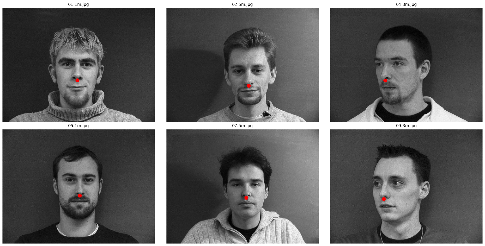
    <figcaption>Samples from dataloader</figcaption>
  </figure>
</div> 

This is the detailed CNN model architecture, summarized by `torchsummary`:

```
----------------------------------------------------------------
        Layer (type)               Output Shape         Param #
================================================================
            Conv2d-1           [-1, 12, 74, 54]             600
              ReLU-2           [-1, 12, 74, 54]               0
         MaxPool2d-3           [-1, 12, 37, 27]               0
            Conv2d-4           [-1, 24, 33, 23]           7,224
              ReLU-5           [-1, 24, 33, 23]               0
         MaxPool2d-6           [-1, 24, 16, 11]               0
            Conv2d-7            [-1, 32, 14, 9]           6,944
              ReLU-8            [-1, 32, 14, 9]               0
         MaxPool2d-9             [-1, 32, 7, 4]               0
          Flatten-10                  [-1, 896]               0
           Linear-11                  [-1, 128]         114,816
             ReLU-12                  [-1, 128]               0
           Linear-13                    [-1, 2]             258
================================================================
Total params: 129,842
Trainable params: 129,842
Non-trainable params: 0
----------------------------------------------------------------
Input size (MB): 0.02
Forward/backward pass size (MB): 1.21
Params size (MB): 0.50
Estimated Total Size (MB): 1.72
----------------------------------------------------------------
```

It can also be interpreted as:

+ Input image: (1, 80, 60);
+ 1st Convolution Layer: 12 output channels, stride 1, no padding, kernel size 7x7, followed by a ReLU and a MaxPool2d of kernel size 2;
+ 2nd Convolution Layer: 24 output channels, stride 1, no padding, kernel size 5x5, followed by a ReLU and a MaxPool2d of kernel size 2;
+ 3rd Convolution Layer: 32 output channels, stride 1, no padding, kernel size 3x3, followed by a ReLU and a MaxPool2d of kernel size 2;
+ A flatten layer, a linear layer to 128 dimensions, a ReLU layer and finally a linear layer to 2 dimensions (2,) which completes a regression task.

I use an Adam optimizer with a learning rate of 1e-3 and MSE as my loss. I try 4 different sets of {LR, Architectures} and find the hyperparameter set of above architecture and LR=1e-3 will bring the best validation loss. Also, the model is trained with 25 epochs.

+ LR: 1e-3 or 5e-3
+ Architecture (List of output channels): [12,24,32] or [24,28,32]

<div style="display: flex; justify-content: space-around;">
  <figure style="text-align: center; margin: 10px;">
    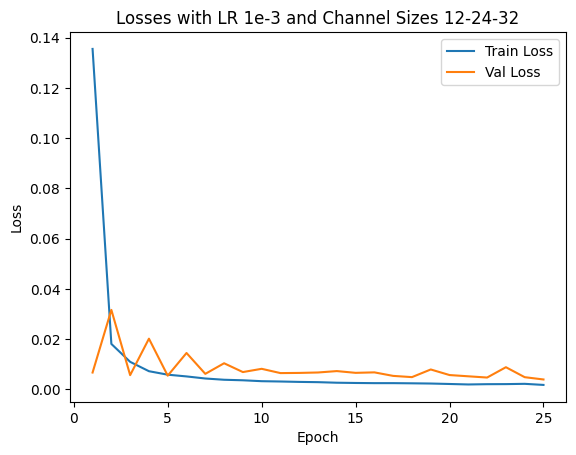
  </figure>
  <figure style="text-align: center; margin: 10px;">
    
  </figure>
</div> 

<div style="display: flex; justify-content: space-around;">
  <figure style="text-align: center; margin: 10px;">
    
  </figure>
  <figure style="text-align: center; margin: 10px;">
    
  </figure>
</div> 

We show 2 correct detection and 2 failed detection:

<div style="display: flex; justify-content: space-around;">
  <figure style="text-align: center; margin: 10px;">
    
    <figcaption>Correct Sample 1</figcaption>
  </figure>
  <figure style="text-align: center; margin: 10px;">
    
    <figcaption>Correct Sample 2</figcaption>
  </figure>
</div> 

<div style="display: flex; justify-content: space-around;">
  <figure style="text-align: center; margin: 10px;">
    
    <figcaption>Incorrect Sample 1</figcaption>
  </figure>
  <figure style="text-align: center; margin: 10px;">
    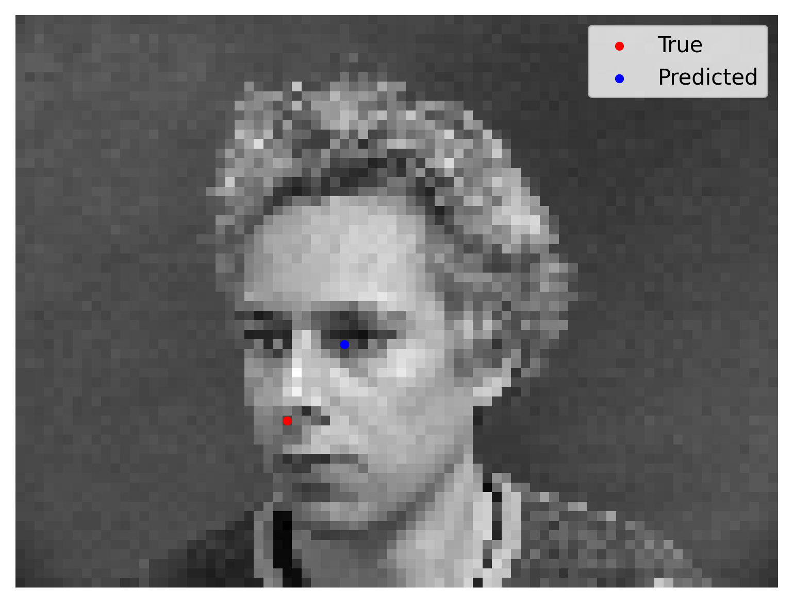
    <figcaption>Incorrect Sample 2</figcaption>
  </figure>
</div> 

# Part 2: Full Facial Keypoints Detection

In this section we want to move forward and detect all 58 facial keypoints/landmarks.

Because the task is harder, to prevent overfitting, I implement data augmentations:

1. Random affine transformation with 10% x/y translation (by 0.5 chance), and with rotation of 15 degrees;
2. Random color jitter with brightness 0.1, hue 0.1, saturation 0.1, contrast 0.1;

Here it's wrong to directly use horizontal flips in the augmentation because if so, the left eye may be flipped to the right of the image, and the model could only learn a mean value i.e. the keypoints are basically concentrated on the middle line, unless we exchange labels by hand.

The samples from the (augmented) dataloader is shown as follows:

<div style="display: flex; justify-content: space-around;">
  <figure style="text-align: center; margin: 10px;">
    
    <figcaption>Samples from dataloader</figcaption>
  </figure>
</div> 

This is the detailed model architecture, summarized by `torchsummary`: (I have also implemented `torchsummary` summaries for part 3 & 4, but the summary will last too long to be exhibited)

```
----------------------------------------------------------------
        Layer (type)               Output Shape         Param #
================================================================
            Conv2d-1         [-1, 32, 180, 240]             320
              ReLU-2         [-1, 32, 180, 240]               0
         MaxPool2d-3          [-1, 32, 90, 120]               0
            Conv2d-4          [-1, 64, 90, 120]          18,496
              ReLU-5          [-1, 64, 90, 120]               0
         MaxPool2d-6           [-1, 64, 45, 60]               0
            Conv2d-7          [-1, 128, 45, 60]          73,856
              ReLU-8          [-1, 128, 45, 60]               0
         MaxPool2d-9          [-1, 128, 22, 30]               0
           Conv2d-10          [-1, 256, 22, 30]         295,168
             ReLU-11          [-1, 256, 22, 30]               0
        MaxPool2d-12          [-1, 256, 11, 15]               0
           Conv2d-13          [-1, 512, 11, 15]       1,180,160
             ReLU-14          [-1, 512, 11, 15]               0
        MaxPool2d-15            [-1, 512, 5, 7]               0
           Conv2d-16            [-1, 512, 5, 7]       2,359,808
             ReLU-17            [-1, 512, 5, 7]               0
        MaxPool2d-18            [-1, 512, 2, 3]               0
          Flatten-19                 [-1, 3072]               0
           Linear-20                 [-1, 2048]       6,293,504
             ReLU-21                 [-1, 2048]               0
           Linear-22                  [-1, 116]         237,684
================================================================
Total params: 10,458,996
Trainable params: 10,458,996
Non-trainable params: 0
----------------------------------------------------------------
Input size (MB): 0.16
Forward/backward pass size (MB): 46.19
Params size (MB): 39.90
Estimated Total Size (MB): 86.25
----------------------------------------------------------------
```

The architecture contains convolution layers of kernel size 3 with channel `1->32->64->128->256->512->512` followed by flattening, a ReLU activation layer and linear layers. We output a (68*2) coordinate group which is a regression task. We have an Adam optimizer with LR 1e-3 and train the model for 300 epochs. The losses are plotted as follows:

<div style="display: flex; justify-content: space-around;">
  <figure style="text-align: center; margin: 10px;">
    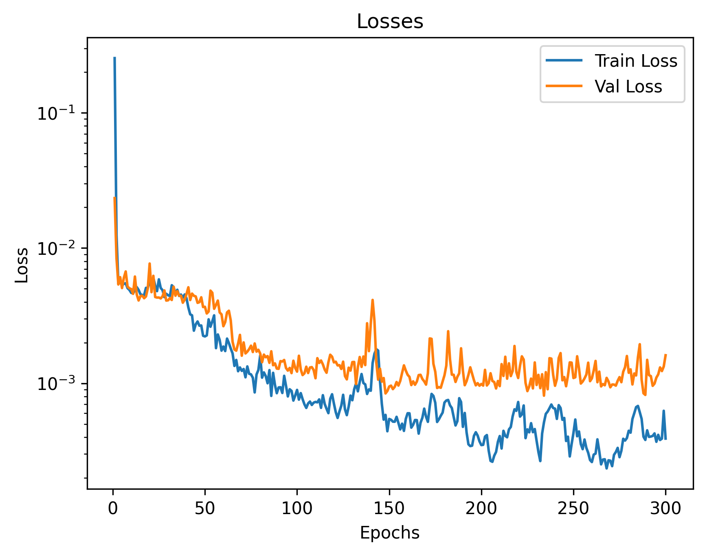
    <figcaption></figcaption>
  </figure>
</div> 

The final validation MSE is 0.0016. We show some correct & incorrect detections, where we define correctly detect samples here by MSE < 5e-4:

<div style="display: flex; justify-content: space-around;">
  <figure style="text-align: center; margin: 10px;">
    
    <figcaption>Correct Sample 1</figcaption>
  </figure>
  <figure style="text-align: center; margin: 10px;">
    
    <figcaption>Correct Sample 2</figcaption>
  </figure>
</div> 

<div style="display: flex; justify-content: space-around;">
  <figure style="text-align: center; margin: 10px;">
    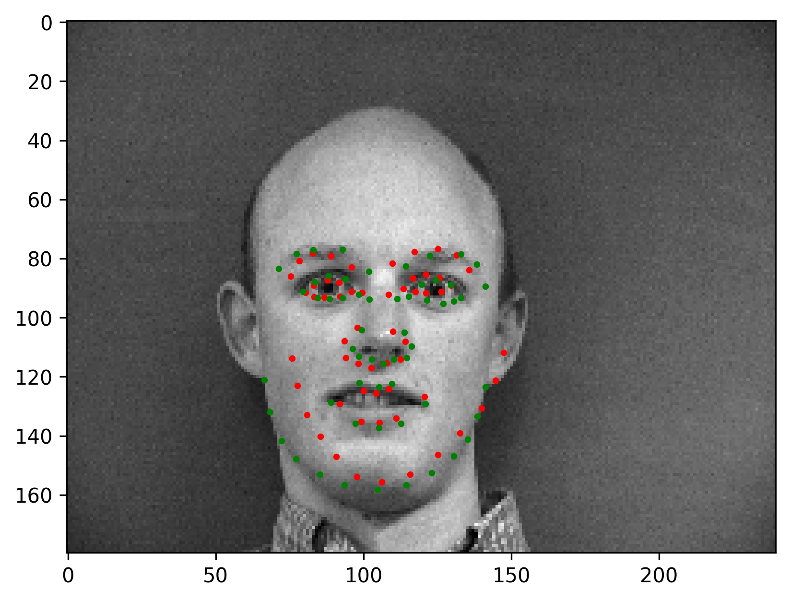
    <figcaption>Incorrect Sample 1</figcaption>
  </figure>
  <figure style="text-align: center; margin: 10px;">
    
    <figcaption>Incorrect Sample 2</figcaption>
  </figure>
</div> 

Here are some visualized filters from the first layer (layer 0), where we can see roughly there are diagonal edge detectors and derivative filters for example.

<div style="display: flex; justify-content: space-around;">
  <figure style="text-align: center; margin: 10px;">
    
    <figcaption>Visualized filters from layer 0, channel 0</figcaption>
  </figure>
</div> 

# Part 3: Train With a Larger Dataset (Regression on iBUG dataset)

In this part and next part, we use ResNets to train on iBUG facial keypoints dataset, where each image contains 68 keypoints. We in this part still do regression tasks for predicting the coordinates.

Given the same data augmentations as part 2, we show some samples from the dataloader which resizes every input image (cropped by a corresponding bounding box) to (224, 224) in preprocessing.

<div style="display: flex; justify-content: space-around;">
  <figure style="text-align: center; margin: 10px;">
    
    <figcaption></figcaption>
  </figure>
  <figure style="text-align: center; margin: 10px;">
    
    <figcaption></figcaption>
  </figure>
  <figure style="text-align: center; margin: 10px;">
    
    <figcaption></figcaption>
  </figure>
  <figure style="text-align: center; margin: 10px;">
    
    <figcaption></figcaption>
  </figure>
</div> 

We can see that the keypoints are often out of the bounding box even though here is no augmentations applied, but for this part, we are doing regression, so it won't hurt much because the output space is $\R$.

We use a ResNet50 architecture and modify the first convolution layer to feed it (N, 1, 224, 224) image batches, also the final linear layer to let it output 136=68*2 real values which can be rearranged as (68, 2) keypoint coordinates.

We use an Adam optimizer with LR 5e-4. We train 20 epochs. The losses are:

<div style="display: flex; justify-content: space-around;">
  <figure style="text-align: center; margin: 10px;">
    
    <figcaption></figcaption>
  </figure>
</div> 

We test on 4 images in the test set:

<div style="display: flex; justify-content: space-around;">
  <figure style="text-align: center; margin: 10px;">
    
    <figcaption></figcaption>
  </figure>
</div> 

It succeeds on all images. The regression seems powerful as is shown above.

For 3 images from my own collection:

<div style="display: flex; justify-content: space-around;">
  <figure style="text-align: center; margin: 10px;">
    
    <figcaption>ZUN</figcaption>
  </figure>
</div> 

A tilted face direction may let the model be not so robust.

<div style="display: flex; justify-content: space-around;">
  <figure style="text-align: center; margin: 10px;">
    
    <figcaption>Cat</figcaption>
  </figure>
</div> 

The model also works on some cats.

<div style="display: flex; justify-content: space-around;">
  <figure style="text-align: center; margin: 10px;">
    
    <figcaption>Zizek</figcaption>
  </figure>
</div> 

This is a correct detection. The regression model will get a test MAE (on Kaggle) of 8.5 publicly and 8.46 privately.

# Part 4: Pixelwise Classification (on iBUG dataset)

In this part, we want to predict heatmaps for "how much probabilities one point would be a nose tip" or "how much probabilities one point would be a right eye", i.e. we are doing pixelwise classification, where the # of classes are 224*224, and every image has 68 subtasks of pixelwise classification like this.

For the dataset preprocessing, we put a Gaussian with a sigma of 0.05 in the scale of the [0,1]-normalized coordinates. Because the Gaussian is discretized and cropped from the infinite real space to the 224*224 coordinates, so we normalize every map and compose them into a (68, 224, 224) shape as the groundtruth, where every (224, 224) heatmap sum to 1.

We use the same data augmentation as above.

Here is a visualized heatmap for one keypoint:

<div style="display: flex; justify-content: space-around;">
  <figure style="text-align: center; margin: 10px;">
    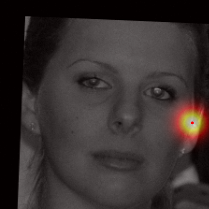
    <figcaption></figcaption>
  </figure>
</div> 

We can find the expected coordinates are not the same as the real labels, but the MAE between them is negligible compared to the scale of MAE of the model predictions.

Here are some visualization for accumulated heatmaps (sums of 68 heatmaps):

<div style="display: flex; justify-content: space-around;">
  <figure style="text-align: center; margin: 10px;">
    
    <figcaption></figcaption>
  </figure>
  <figure style="text-align: center; margin: 10px;">
    
    <figcaption></figcaption>
  </figure>
</div> 

My model architecture is a UNet inherited from the Unconditional UNet from Project 5B, which is basically this but the input is changed from (1, 28, 28) to (1, 224, 224), and the output is changed to (68, 224, 224). Also, we specify $D=128$ here.

<div style="display: flex; justify-content: space-around;">
  <figure style="text-align: center; margin: 10px;">
    
    <figcaption></figcaption>
  </figure>
</div> 

I optimize the MSE losses between the groundtruth discretized Gaussian heatmaps and the predicted heatmaps which is normalized from logits by softmax over a squeezed dimension of size 224*224. The MSE has a reduction method as summation instead of mean, otherwise the loss will be extremely small (to 1e-9 scale) and the model can hardly learn anything.

I use an Adam optimizer with LR 5e-3, a batch size of 32, and train 25 epochs.

From epoch 0 to 2, the outputted heatmaps are just doing copies of the input images and the (absolute coordinate) MAE plateaus at about 55, but one can see the phenomenon of emergence from epoch 3 as the model starts to destroy the input signal and think about the supervising signal i.e. the Gaussian groundtruth heatmaps. After it becomes aware of the heatmap formalism, it starts to move its predicted high-probability district from some irrelevant places towards the groundtruth label coordinates.

<div style="display: flex; justify-content: space-around;">
  <figure style="text-align: center; margin: 10px;">
    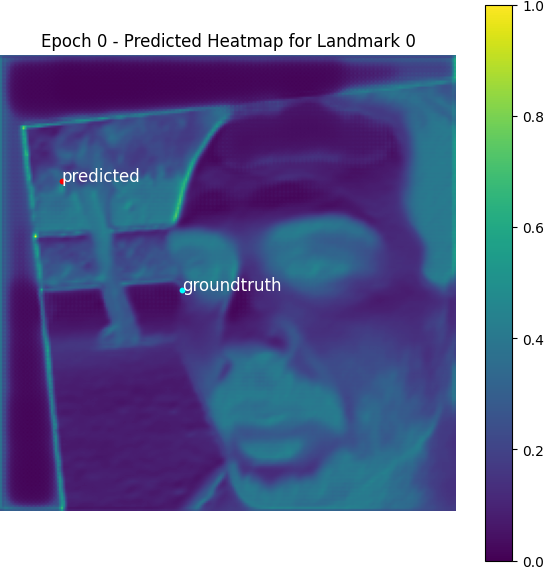
    <figcaption>Epoch 0, Landmark 0</figcaption>
  </figure>
  <figure style="text-align: center; margin: 10px;">
    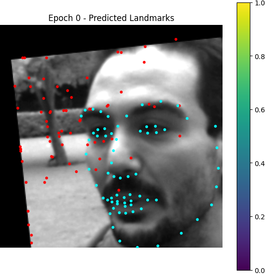
    <figcaption>Epoch 0, predicted landmarks</figcaption>
  </figure>
</div> 

<div style="display: flex; justify-content: space-around;">
  <figure style="text-align: center; margin: 10px;">
    
    <figcaption>Epoch 3, Landmark 0</figcaption>
  </figure>
  <figure style="text-align: center; margin: 10px;">
    
    <figcaption>Epoch 3, predicted landmarks</figcaption>
  </figure>
</div> 

<div style="display: flex; justify-content: space-around;">
  <figure style="text-align: center; margin: 10px;">
    
    <figcaption>Epoch 15, Landmark 0</figcaption>
  </figure>
  <figure style="text-align: center; margin: 10px;">
    
    <figcaption>Epoch 15, predicted landmarks</figcaption>
  </figure>
</div> 

<div style="display: flex; justify-content: space-around;">
  <figure style="text-align: center; margin: 10px;">
    
    <figcaption>Epoch 24, Landmark 0</figcaption>
  </figure>
  <figure style="text-align: center; margin: 10px;">
    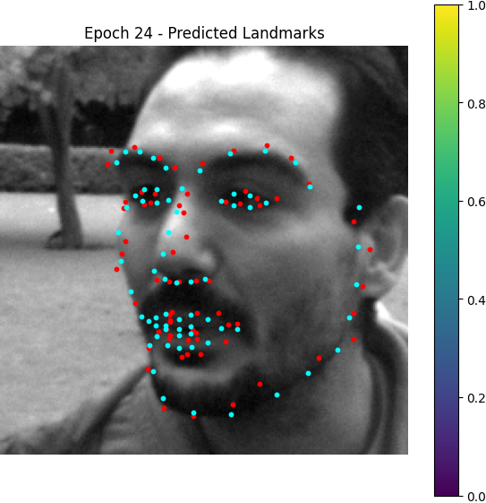
    <figcaption>Epoch 24, predicted landmarks</figcaption>
  </figure>
</div> 

Here is the losses plotted:

<div style="display: flex; justify-content: space-around;">
  <figure style="text-align: center; margin: 10px;">
    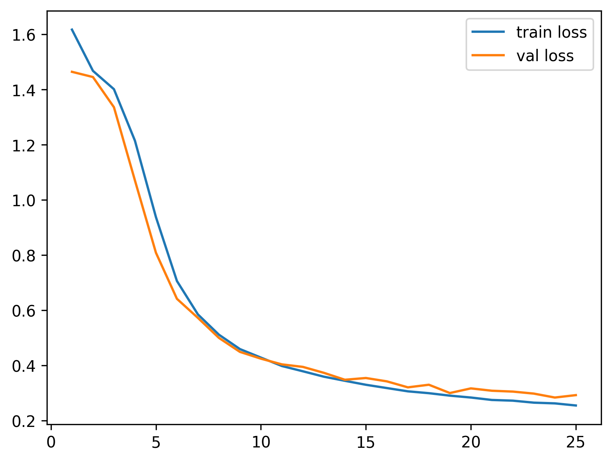
    <figcaption></figcaption>
</div> 

Some test images:

<div style="display: flex; justify-content: space-around;">
  <figure style="text-align: center; margin: 10px;">
    
    <figcaption></figcaption>
</div> 

We can see the bottom left image is predicted so well, but the other 3 has some little flaws. Actually this setup will get a test score (on Kaggle) of about 9.39 publicly and 9.46 privately, which is not as good as the regression model. I think it's because the UNet may be too burdened to express when we want to extract 68 channels from one channel.

Testing on my collected images:

<div style="display: flex; justify-content: space-around;">
  <figure style="text-align: center; margin: 10px;">
    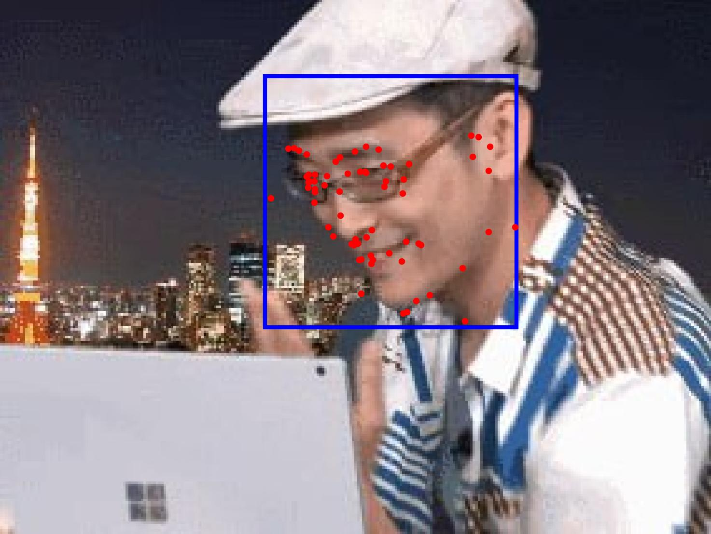
    <figcaption>ZUN</figcaption>
  </figure>
</div> 

For this image, the model still fails, but we can see a rough form of face profiles.

<div style="display: flex; justify-content: space-around;">
  <figure style="text-align: center; margin: 10px;">
    
    <figcaption>Cat</figcaption>
  </figure>
</div> 

This time, the model does not generalize to cats.

<div style="display: flex; justify-content: space-around;">
  <figure style="text-align: center; margin: 10px;">
    
    <figcaption>Zizek</figcaption>
  </figure>
</div> 

I think this is a successful detection.