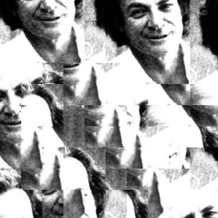

## Final Project 3/3: Image Quilting

*COMPSCI 180 [Intro to Computer Vision and Computational Photography](https://inst.eecs.berkeley.edu/~cs180/fa24/)*

Chuyan Zhou

This webpage uses the Typora **Academic** theme of markdown files.

The project spec is [here](https://yxw.cs.illinois.edu/course/CS445/F21/projects/quilting/ComputationalPhotography_ProjectQuilting.html).

# Overview

The goal of this assignment is to implement the image quilting algorithm for texture synthesis and transfer, described in this SIGGRAPH 2001 [paper](https://people.eecs.berkeley.edu/~efros/research/quilting/quilting.pdf) by Efros and Freeman. Texture synthesis is the creation of a larger texture image from a small sample. Texture transfer is giving an object the appearance of having the same texture as a sample while preserving its basic shape (see the face on toast image above). For texture synthesis, the main idea is to sample patches and lay them down in overlapping patterns, such that the overlapping regions are similar. The overlapping regions may not match exactly, which will result in noticeable edges. To fix this, you will compute a path along pixels with similar intensities through the overlapping region and use it to select which overlapping patch from which to draw each pixel. Texture transfer is achieved by encouraging sampled patches to have similar appearance to a given target image, as well as matching overlapping regions of already sampled patches. In this project, you will apply important techniques such as template matching, finding seams, and masking. These techniques are also useful for image stitching, image completion, image retargeting, and blending.

We have some sample images:

  <figure style="text-align: center; margin: 10px;">
    
    <figcaption>Bricks</figcaption>
  </figure>
  <figure style="text-align: center; margin: 10px;">
    
    <figcaption>Feynman</figcaption>
  </figure>
  <figure style="text-align: center; margin: 10px;">
    
    <figcaption>Sketch</figcaption>
  </figure>
  <figure style="text-align: center; margin: 10px;">
    
    <figcaption>Text</figcaption>
  </figure>
  <figure style="text-align: center; margin: 10px;">
    
    <figcaption>White</figcaption>
  </figure>

 

# Part 1. Randomly Sampled Texture

By filling patches sequentially which are chosen randomly from the original image, we create a naive method of doing texture synthesis.

  <figure style="text-align: center; margin: 10px;">
    
    <figcaption>Bricks</figcaption>
  </figure>
  <figure style="text-align: center; margin: 10px;">
    
    <figcaption>Feynman</figcaption>
  </figure>
  <figure style="text-align: center; margin: 10px;">
    
    <figcaption>Sketch</figcaption>
  </figure>
  <figure style="text-align: center; margin: 10px;">
    
    <figcaption>Text</figcaption>
  </figure>
  <figure style="text-align: center; margin: 10px;">
    
    <figcaption>White</figcaption>
  </figure>

 

# Part 2. Overlapping Patches

By finding matches by computing SSD for overlapping regions, a simple quilting method is built. The SSD computing here can be accelerated by using correlation methods instead of plain for-loops. Also we have a tolerance `tol` here to randomly choose best `tol` matches of candidate patches.

  <figure style="text-align: center; margin: 10px;">
    
    <figcaption>Bricks</figcaption>
  </figure>
  <figure style="text-align: center; margin: 10px;">
    
    <figcaption>Feynman</figcaption>
  </figure>
  <figure style="text-align: center; margin: 10px;">
    
    <figcaption>Sketch</figcaption>
  </figure>
  <figure style="text-align: center; margin: 10px;">
    
    <figcaption>Text</figcaption>
  </figure>
  <figure style="text-align: center; margin: 10px;">
    
    <figcaption>White</figcaption>
  </figure>

 
