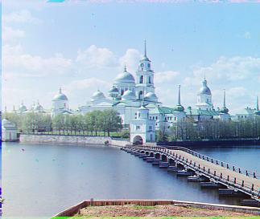
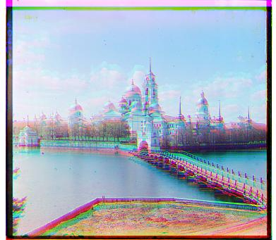
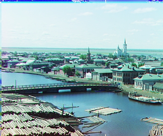
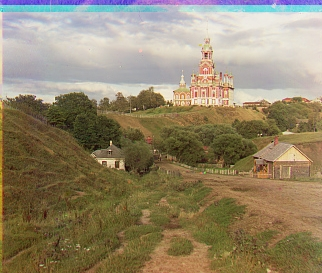
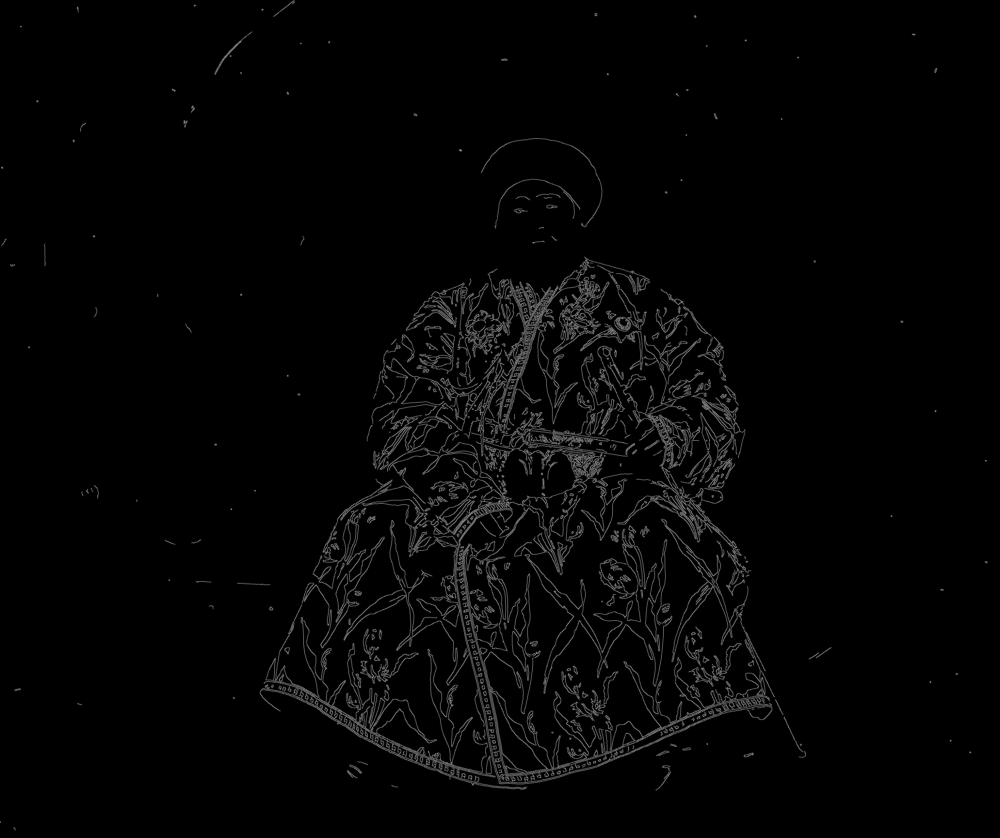
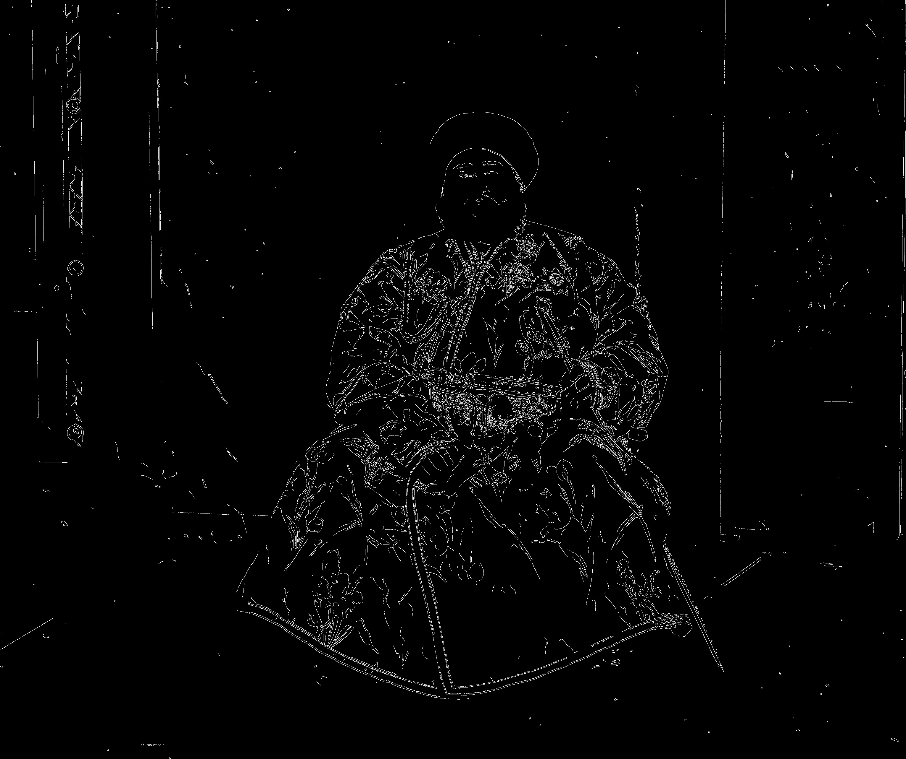
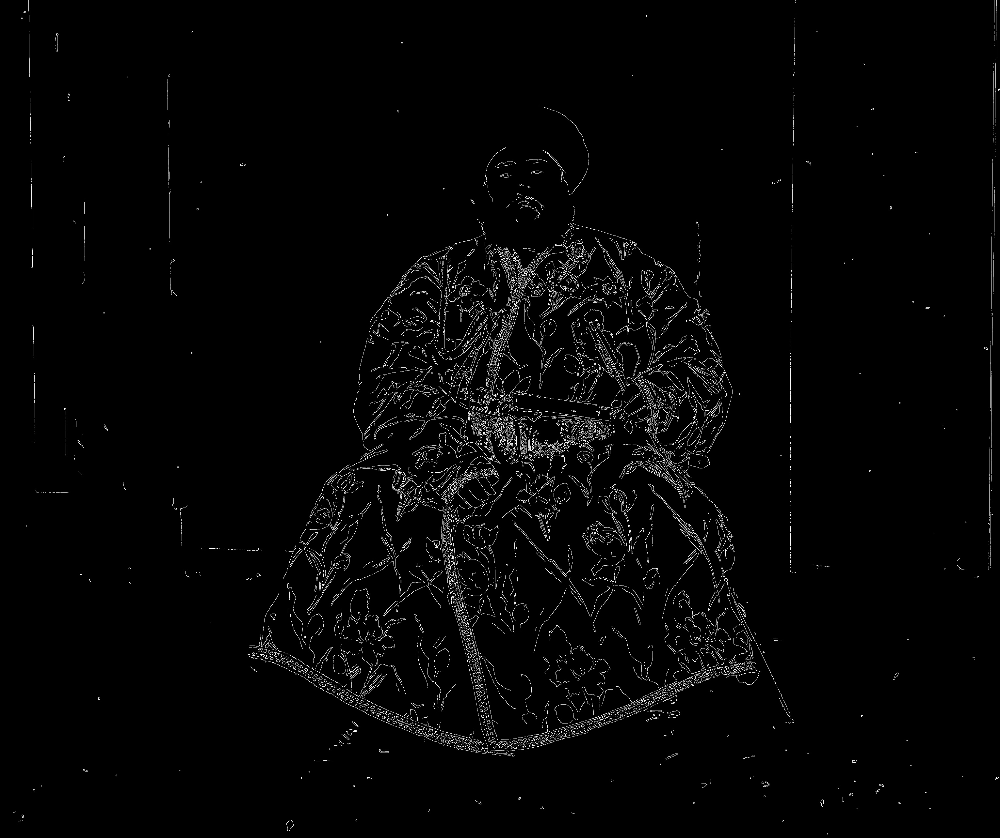

## Programming Project #1 (`proj1`)

*COMPSCI 180 [Intro to Computer Vision and Computational Photography](https://inst.eecs.berkeley.edu/~cs180/fa24/)*

Chuyan Zhou

This webpage uses the Typora **Newsprint** theme of markdown files.

# Overview

[Sergei Mikhailovich Prokudin-Gorskii](http://en.wikipedia.org/wiki/Prokudin-Gorskii) (1863-1944) [Сергей Михайлович Прокудин-Горский, to his Russian friends] was a man well ahead of his time. Convinced, as early as 1907, that color photography was the wave of the future, he won Tzar's special permission to travel across the vast Russian Empire and take color photographs of everything he saw including the only color portrait of [Leo Tolstoy](http://en.wikipedia.org/wiki/Leo_Tolstoy). And he really photographed everything: people, buildings, landscapes, railroads, bridges... thousands of color pictures! His idea was simple: record three exposures of every scene onto a glass plate using a red, a green, and a blue filter. Never mind that there was no way to print color photographs until much later -- he envisioned special projectors to be installed in "multimedia" classrooms all across Russia where the children would be able to learn about their vast country. Alas, his plans never materialized: he left Russia in 1918, right after the revolution, never to return again. Luckily, his RGB glass plate negatives, capturing the last years of the Russian Empire, survived and were purchased in 1948 by the Library of Congress. The LoC has recently digitized the negatives and made them available on-line.

The goal of this assignment is to take the digitized Prokudin-Gorskii glass plate images and, using image processing techniques, automatically produce a color image with as few visual artifacts as possible. In order to do this, you will need to extract the three color channel images, place them on top of each other, and align them so that they form a single RGB color image.

# Step 1: Preprocessing

Every image provided is a digitized glass plate image vertically arranged, with one example, the original `cathedral.jpg` listed as follows:

Given the images, i.e. digitized glass plate images, black and white borders appear constantly in every one of them. Because evaluating the similarity metrics of two image channels may be influenced by these borders, we can do some preprocessing to avoid this consequence. First, we directly cut the original rectangle-shaped image into 3 equal parts (shapes of which are ensured to be the same), BGR top to bottom; and we just crop the B/G/R channel subimages by 10% of the height of each subimage. After this procedure, no borders are visible given the project data.

This is actually proved effective. For example, the cropped version aligned with NCC exhaustive search of `monastery.jpg`:

is significantly visibly better than the uncropped version:

# Step 2: Exhaustive Search

We align Green/Red channels to the Blue channel, and we will displace these channels by the `roll` function in the NumPy library.

## 2.1 Algorithm Overview

To align one image (G/R channel) to another (B channel), i.e. to displace (roll) one image while another works as a fixed reference, the naive idea is to try a range of displacement vectors (tuples) of the first image (we call `img1`), evaluate every possible displacement with a metric, and then choose the best one w.r.t. the optimum of the metric, which may be maximum or minimum.

Some metrics are given in the description, which we first implement for the baseline method.

The range here is set as $[-15,15]$ both in width and height.

## 2.2 Sum of Squared Differences (SSD)

For the image `img1` and the reference `img2`, denote them as $I_1$ and $I_2$. Also denote the rolled `img1` as $I_1'$.

The SSD is the sum of all squared differences of every pair of pixels in the same position in the two images, i.e.
$$
SSD(I_1',I_2)=\sum_{i,j}[{(I_1')}_{i.j}-(I_2)_{i,j}]^2,
$$
where every $(i,j)$ pair is a pixel position.

We search for the minimum SSD to find the best alignment.

Notice the MSE/Euclid distance metrics are just variants (in this project), because if we want to minimize these metrics, the minimizers will be the same as the SSD version.

## 2.3 Normalized Cross-Correlation (NCC)

The other metric given is NCC, which is the dot product of the two images flattened and then normalized, i.e.
$$
NCC(I_1',I_2)={\sum_{i,j}(I_1')_{i,j}(I_2)_{i,j}\over ||I_1'||_F||I_2||_F},
$$
where $||\cdot||_F$ denotes the Frobenius norm just equal to the square root of the sum of all squared elements in the matrix.

## 2.4 Results for JPEGs

With exhaustive search implemented, we are able to find decent displacements for the images. These are the results and their displacement vectors.

  <figure style="text-align: center; margin: 10px;">
    
    <figcaption>cathedral.jpg</figcaption>
    <figcaption>Green: (5, 2)
				Red: (12, 3)</figcaption>
  </figure>
  <figure style="text-align: center; margin: 10px;">
    
    <figcaption>monastery.jpg</figcaption>
    <figcaption>Green: (-3, 2)
				Red: (3, 2)</figcaption>
  </figure>
  <figure style="text-align: center; margin: 10px;">
    
    <figcaption>tobolsk.jpg</figcaption>
    <figcaption>Green: (3, 3)
				Red: (6, 3)</figcaption>
  </figure>

SSD and NCC metrics turn out to have the same displacement results for these 3 images.

## 2.5 Problem met

For TIFF images given, the file sizes are too large for exhaustive search to process in a reasonable time span. We have to find some new methods to reduce the time complexity here.

# Step 3: Image Pyramid

## 3.1 Algorithm Overview

Image pyramid algorithm is to process one image or multiple images by first processing on the low resolution levels, and then use the scaled processing actions to process relatively high resolution levels until processing the original image.

Different levels, with level 0 as the original image, are placed in order and processed in order. We call the ordered list or stack a pyramid. The pyramid top is the smallest scale.

In the scenario here, i.e. image alignment, we build a pyramid for `img1` i.e. $[I_1, D(I_1), \cdots, D^{(n)}(I_1)]$ and also for `img2` i.e. $[I_2, D(I_2), \cdots, D^{(n)}(I_2)]$. The number $n$ is subject to the condition that $D^{(n)}(\cdot)$ should has a minimum of the width and height as a fixed number of pixels. We set this 200 in this project. Also, $D(\cdot)$ is the denotation for downsampling an image to 1/2 width and height, where 1/2 is a parameter that we can adjust to smaller scale.

To leverage the image pyramid to search for the displacement, we first use exhaustive search for the $D^{(n)}(I_1)$. Because the image is 200-pixel scale, the exhaustive search here is very fast compared to the original one. Then we save the displacement to this level.

Then, repeat: roll the current level image in 2x scale displacement from last level; exhaustively search for a best displacement for the current level image that has been rolled; add new displacement to the 2x-scaled displacement; save the updated displacement (and go into the next level where we apply the 2x displacement in the current level), until there is no next level, namely, we reach the original image.

Notice that because we choose 2x as the scaling factor, so every time we go to the next level, there will be one new pixel added back which is filled in the gap of the two pixels in current level. Hence, the searching space can be compressed to $[-1,1]$ both in width and height, i.e. one 3x3 square, except for the top level, where we set the searching space $[-25,25]$ both in width and height. If we use a scaling factor $s$, we should search $[-s+1,s-1]$ in width and height.

We can still use the metric above, and the result will not change because the overall searching spaces are equivalent.

## 3.2 Results for all

Because of the file sizes are too large, we post the jpeg-compressed images of all tiffs here.

NCC and SSD lead to same displacement results. Also, in the TIFF-processing stage, the NCC method will run slower than SSD. The SSD pyramid will take about 38s, while the NCC takes about 1min.

  <figure style="text-align: center; margin: 10px;">
    
    <figcaption>Harvesters</figcaption>
    <figcaption>Green: (59, 16) Red: (124, 13)</figcaption>
  </figure>
  <figure style="text-align: center; margin: 10px;">
    
    <figcaption>Self Portrait</figcaption>
    <figcaption>Green: (78, 29) Red: (176, 37)</figcaption>
  </figure>

  <figure style="text-align: center; margin: 10px;">
    
    <figcaption>Melons</figcaption>
    <figcaption>Green: (81, 10) Red: (178, 13)</figcaption>
  </figure>
  <figure style="text-align: center; margin: 10px;">
    
    <figcaption>Church</figcaption>
    <figcaption>Green: (25, 4) Red: (58, -4)</figcaption>
  </figure>

  <figure style="text-align: center; margin: 10px;">
    
    <figcaption>Icon</figcaption>
    <figcaption>Green: (41, 17) Red: (89, 23)</figcaption>
  </figure>
  <figure style="text-align: center; margin: 10px;">
    
    <figcaption>Emir</figcaption>
    <figcaption>Green: (49, 24) Red: (98, -206)</figcaption>
  </figure>

  <figure style="text-align: center; margin: 10px;">
    
    <figcaption>Train</figcaption>
    <figcaption>Green: (42, 5) Red: (87, 32)</figcaption>
  </figure>
  <figure style="text-align: center; margin: 10px;">
    
    <figcaption>Monastery</figcaption>
    <figcaption>Green: (-3, 2) Red: (3, 2)</figcaption>
  </figure>

  <figure style="text-align: center; margin: 10px;">
    
    <figcaption>Sculpture</figcaption>
    <figcaption>Green: (33, -11) Red: (140, -27)</figcaption>
  </figure>
  <figure style="text-align: center; margin: 10px;">
    
    <figcaption>Tobolsk</figcaption>
    <figcaption>Green: (3, 3) Red: (6, 3)</figcaption>
  </figure>

  <figure style="text-align: center; margin: 10px;">
    
    <figcaption>Onion Church</figcaption>
    <figcaption>Green: (51, 26) Red: (108, 36)</figcaption>
  </figure>
  <figure style="text-align: center; margin: 10px;">
    
    <figcaption>Three Generations</figcaption>
    <figcaption>Green: (53, 14) Red: (112, 11)</figcaption>
  </figure>

  <figure style="text-align: center; margin: 10px;">
    
    <figcaption>Cathedral</figcaption>
    <figcaption>Green: (5, 2) Red: (12, 3)</figcaption>
  </figure>
  <figure style="text-align: center; margin: 10px;">
    
    <figcaption>Lady</figcaption>
    <figcaption>Green: (51, 9) Red: (111, 12)</figcaption>
  </figure>

## 3.3 The Problem of Emir

With just searching the displacements over cropped images, and just SSD/NCC metrics, the `emir.tif` is not aligned well, because the images to be matched do not actually have the same brightness values (they are different color channels). We can balance the brightness values or use some other metrics & methods.

# Step 4: Cleverer Metrics

We use the metrics introduced below combined with the image pyramid method to try to align the emir's image correctly.

## 4.1 Mutual Information (MI)

We can evaluate the MI metric of two images. In probability theory and information theory, the mutual information given two discrete random variables $X$ and $Y$ is defined as
$$
MI(X;Y)=\sum_{x\in\mathcal X}\sum_{y\in\mathcal Y}P_{X,Y}(x,y)\log\left({P_{X,Y}(x,y)\over P_X(x) P_Y(y)}\right)
\\ = H(X)+H(Y)-H(X,Y),
$$
where $H(\cdot)$ is the entropy operator.

For two images mentioned before as `img1` and `img2`, or $I_1$ and $I_2$, for the rolled $I_1'$ and $I_2$ we have the mutual information
$$
MI(I_1',I_2) =\sum_{i,j} P(x_{i,j},y_{i,j})\log\left(P(x_{i,j},y_{i,j})\over P_1(x_{i,j})P_2(x_{i,j})\right),
$$
where $x_{i,j}$ denotes the pixel in $I_1'$ in the position $(i,j)$, i.e. $x_{i,j} = (I_1')_{i,j}$ and $y_{i,j}=(I_2)_{i,j}$ here for simplicity.

For the probability symbols, $P(\cdot,\cdot)$ denotes the joint probability of two pixel values appearing in the same position within the two images, and $P_1(\cdot)$ denotes the marginal probability that one pixel value appears in $I_1'$, and $P_2(\cdot)$ is that for $I_2$.

Because the mutual information [quantifies](https://en.wikipedia.org/wiki/Mutual_information#) the "amount of information" obtained about one variable when observing another variable, it is better when the mutual information is higher. So we **maximize** the MI metric for the best displacement of G/R with B as reference.

### 4.1.1 The Emir w.r.t. MI

**Green: (49, 23)**
**Red: (106, 40)**

We can see the channels align correctly now under this metric.

### 4.1.2 Running Time

Though MI is an effective metric, it is much more time-consuming than provided SSD or NCC metrics, with the same parameter set of the pyramid method. For the emir, it takes about 40s to find the displacement under MI, but only about 3~5s to find the displacement under SSD/NCC.

## 4.2 Structural Similarity Index Measure (SSIM)

For the images $A$ and $B$, the SSIM metric is defined as
$$
SSIM(A,B)=[l(A,B)]^\alpha[c(A,B)]^\beta[s(A,B)]^\gamma,
$$
where $l(A,B)$ is the luminance comparison, $c(A,B)$ is the contrast comparison, and $s(A,B)$ is the structure comparison. The $\alpha,\beta,\gamma$ are the weights for these three comparisons.

$l$, $c$, and $s$ are defined as
$$
l(A,B)={2\mu_A\mu_B+C_1\over \mu_A^2+\mu_B^2+C_1},
$$
$$
c(A,B)={2\sigma_A\sigma_B+C_2\over \sigma_A^2+\sigma_B^2+C_2},
$$
$$
s(A,B)={\sigma_{AB}+C_3\over \sigma_A\sigma_B+C_3},
$$
where $\mu_A$ and $\mu_B$ are the means of $A$ and $B$, $\sigma_A$ and $\sigma_B$ are the standard deviations of $A$ and $B$, and $\sigma_{AB}$ is the covariance of $A$ and $B$. $C_1$, $C_2$, and $C_3$ are constants to avoid zero denominators.

In the most common case, $\alpha=\beta=\gamma=1$, and $C_1=(k_1L)^2$, $C_2=(k_2L)^2$, $C_3=C_2/2$, where $L$ is the dynamic range or the data range of the pixel values, and $k_1=0.01$ and $k_2=0.03$ are constants.

We can thus simplify the SSIM metric as
$$
SSIM(A,B)={2\mu_A\mu_B+C_1\over \mu_A^2+\mu_B^2+C_1}\cdot{2\sigma_A\sigma_B+C_2\over \sigma_A^2+\sigma_B^2+C_2}\cdot{\sigma_{AB}+C_3\over \sigma_A\sigma_B+C_3}=
% {\frac {(2\mu _{x}\mu _{y}+c_{1})(2\sigma _{xy}+c_{2})}{(\mu _{x}^{2}+\mu _{y}^{2}+c_{1})(\sigma _{x}^{2}+\sigma _{y}^{2}+c_{2})}}
\\
{\frac {(2\mu _{A}\mu _{B}+C_1)(2\sigma _{AB}+C_2)}{(\mu _{A}^{2}+\mu _{B}^{2}+C_1)(\sigma _{A}^{2}+\sigma _{B}^{2}+C_2)}}.
$$

We **maximize** the simplified SSIM metric to find the best alignment, because it evaluates the similarity between two images. 

In application, because human eyes perceive an image in a localized way ([Saccadic Eye Movement](https://www.physiotutors.com/wiki/saccadic-eye-movement/#:~:text=To start the exam%2C the,moved in several different directions.)), so we find the means and variances of a localized part (a window with a uniform filter). We first convolute the image through the filter, and then find the overall mean value of the convoluted image.

### 4.2.1 The Emir w.r.t. SSIM

**Green: (50, 23)**
**Red: (105, 40)**

Though the displacement is slightly different with the MI one, we can see the channels align correctly now under this metric.

### 4.2.2 Running Time

It takes about 30s to run, which is better than MI and still slower than SSD/NCC.

# Step 5: Edge Detection

Edge detection algorithms can also used to solve the problem of emir. We implement the method that first detect the edges of three channels, and then align the edges, output the displacements to the original image and finally roll the original image by the displacements created by the edge alignment.

We align the edge images by the image pyramid speed-up method and the SSD metric, so this can be seen as another kind of preprocessing or feature engineering of images fed into searching methods.

## 5.1 Canny Edge Detection

The Canny Algorithm for edge detection is a renowned algorithm with merits such as high accuracy and high resolution of edges detected.

### 5.1.1 Algorithm Overview

The Canny edge detection is divided in 4 steps in order.

1. Use the Gaussian filter to smooth the image $I$ and deal with the noise: $I\gets K_G*I$, where $K_G$ is the filter kernel.

2. Use the [Sobel operator](https://en.wikipedia.org/wiki/Sobel_operator) as a filter to estimate the gradients of the image $G$:
   $$
   G_x=\begin{bmatrix}-1&0&1\\-2&0&2\\-1&0&1\end{bmatrix}*I
   \\
   G_y=\begin{bmatrix}-1&-2&-1\\0&0&0\\1&2&1\end{bmatrix}*I
   \\
   G=\sqrt{G_x^2+G_y^2},\theta=\arctan(G_y/G_x),
   $$
   where the root and the arctan are elementwise. The gradients are defined as $G_x(i,j)=I_{i+1,j}-I_{i,j}$, and $G_y(i,j)=I_{i,j+1}-I_{i,j}$.

3. Non-maximum suppression, which is to generate the edge from the gradient matrix by setting all zero to non-maximum pixels around one pixel along the max-gradient direction.

4. Set low and high thresholds for gradients. Gradients higher than the high threshold will be seen as edges, those lower than the low threshold will be seen as non-edges. Those in between will be seen as edges only if there are 2 higher-than-threshold gradient pixels around.

Once these steps are complete, we can use these the edge images (final-processed $I$) to do the same alignment using the same set of metrics and the image pyramid method.

### 5.1.2 Result

The result is shown as:

**Green: (49, 24)**
**Red: (107, 40)**

The edges detected is shown as follows:

  <figure style="text-align: center; margin: 10px;">
    
    <figcaption>B</figcaption>
  </figure>
  <figure style="text-align: center; margin: 10px;">
    
    <figcaption>G</figcaption>
  </figure>
  <figure style="text-align: center; margin: 10px;">
    
    <figcaption>R</figcaption>
  </figure>

## 5.2 Sobel Edge Detection

### 5.2.1 Algorithm Overview

This algorithm, though much simpler than the last one, can also generate good edge detection results for us to align the channels.

This involves using the Sobel operator mentioned above to find $G_x$ and $G_y$, and create an image with edges by simply cauculate $G=\sqrt{G_x^2+G_y^2}$.

### 5.2.2 Result

Because this algorithm is relatively simple, the detected edges here appear rougher than the Canny's result. 

The result is shown as:

**Green: (49, 24)**
**Red: (106, 41)**

The edges detected is shown as follows:

  <figure style="text-align: center; margin: 10px;">
    
    <figcaption>B</figcaption>
  </figure>
  <figure style="text-align: center; margin: 10px;">
    
    <figcaption>G</figcaption>
  </figure>
  <figure style="text-align: center; margin: 10px;">
    
    <figcaption>R</figcaption>
  </figure>

