## Programming Project #2 (`proj2`)

*COMPSCI 180 [Intro to Computer Vision and Computational Photography](https://inst.eecs.berkeley.edu/~cs180/fa24/)*

Chuyan Zhou

This webpage uses the Typora **Newsprint** theme of markdown files.

# Part 1: Fun with Filters

## 1.1 Finite Difference Operator

Here we have the finite difference operators respectively horizontal and vertical as
$$
D_x=\begin{bmatrix}1&-1\end{bmatrix},\quad D_y=\begin{bmatrix}1\\-1\end{bmatrix}.
$$
To compute the gradient which is given by
$$
g_x(i,j)={A(i+1,j)-A(i,j)},\quad g_y(i,j)=A(i,j+1)-A(i,j),
$$
where $A$ is the original image, we can just convolute the image with the two operators:
$$
g_x=D_x*A,\quad g_y=D_y*A,
$$
and we have the right as the original point for $D_x$, the below as the original point for $D_y$. In the practice (the code), we use the method `scipy.signal.convolve2d` where the mode is `'same'` (the size of the result is kept same as the original image $A$). 

To find the magnitude from the gradients, we use
$$
|g|(i,j)=\sqrt{g_x^2(i,j)+g_y^2(i,j)},
$$
written as elementwise (pixelwise)
$$
|g|=\sqrt{g_x^2+g_y^2.}
$$
To show the gradient or magnitude images, we should first normalize them. In this project, we treat all images in default with the float data type, so the normalized pixel range should be at $[0,1]$ to be mapped into $[0,255]\cap \Z$.

Denote normalized $g_x$ as $g_x^N$, normalized $g_y$ as $g_y^N$, normalized $|g|$ as $|g|^N$, we have
$$
g_x^N=\frac12 g_x+\frac12,\quad g_y^N=\frac12 g_y+\frac12,\quad |g|^N={|g|\over \sqrt 2}.
$$
The magnitude image of the gradients is like a rough edge detection result, and we can further apply binarizing with thresholding on this image in order to suppress the noise and find real edges. We choose a threshold of 0.2 here, i.e. if a pixel in the magnitude image is greater than 0.2, then it is preserved as a part of edges and the value of it is set as 1; otherwise, it is considered not in an edge and the value is set as 0.

Shown below are the original image, the gradient images (normalized), the magnitude image, the binarized magnitude image.

  <figure style="text-align: center; margin: 10px;">
    
    <figcaption>The original cameraman.png image</figcaption>
  </figure>

  <figure style="text-align: center; margin: 10px;">
    
    <figcaption>The x-axis gradient (normalized)</figcaption>
  </figure>
  <figure style="text-align: center; margin: 10px;">
    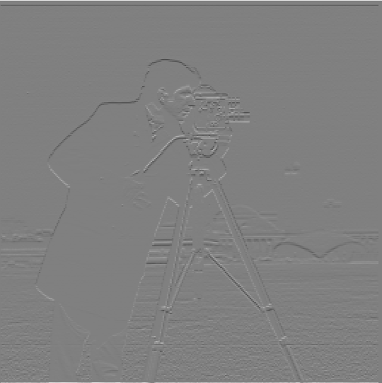
    <figcaption>The y-axis gradient (normalized)</figcaption>
  </figure>

<figure style="text-align: center; margin: 10px;">
    
    <figcaption>Magnitude image (normalized)</figcaption>
  </figure>
  <figure style="text-align: center; margin: 10px;">
    
    <figcaption>Binarized normalized magnitude image</figcaption>
  </figure>

## 1.2 Derivative of Gaussian (DoG) Filter

### 1.2.1 First Gaussian then Gradient

By applying a Gaussian filter $G$ to the original image using the outer product of the 1D Gaussian given by `cv2.getGaussianKernel()`, i.e.
$$
\hat A:=G*A,
$$
we have the blurred image $\hat A$ as

  <figure style="text-align: center; margin: 10px;">
    
    <figcaption>The cameraman.png image filtered (blurred) with Gaussian kernel</figcaption>
  </figure>

The gradient for the blurred image is
$$
\hat g_x=D_x*(G*A),\quad\hat g_y=D_y*(G*A).
$$

At this section and the section 1.2.2, we choose the Gaussian kernel with parameters $\sigma=1$ and the kernel size $7\times 7$ to avoid artifacts brought by insufficient wrapping of the peak of the 2D Gaussian ($3\sigma$ convention).

We do the same procedures as part 1.1, and choose a different (lower) threshold as 0.07 because the noise has been filtered through the Gaussian filter. 

  <figure style="text-align: center; margin: 10px;">
    
    <figcaption>The x-axis gradient (normalized)</figcaption>
  </figure>
  <figure style="text-align: center; margin: 10px;">
    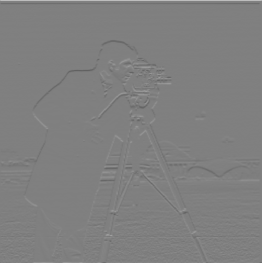
    <figcaption>The y-axis gradient (normalized)</figcaption>
  </figure>

<figure style="text-align: center; margin: 10px;">
    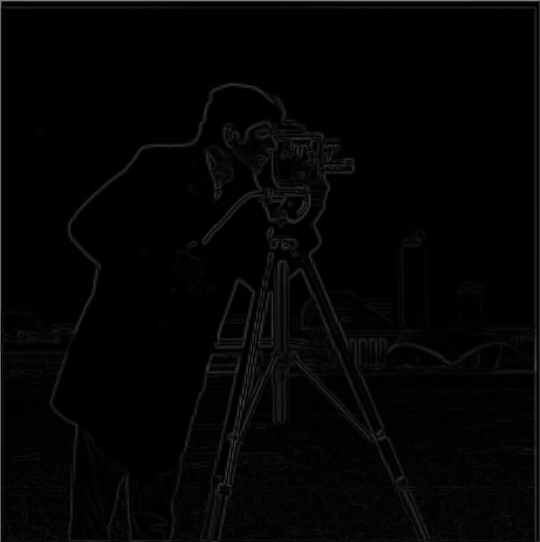
    <figcaption>Magnitude image (normalized)</figcaption>
  </figure>
  <figure style="text-align: center; margin: 10px;">
    
    <figcaption>Binarized normalized magnitude image</figcaption>
  </figure>

### 1.2.2 Derivative of Gaussian filter

We can also combine the derivative operator with the Gaussian kernel, and use the combined operators i.e. DoG filters (for two axes) to convolve the image. This is to say, $\hat g_x$ and $\hat g_y$, the gradients of the blurred image w.r.t. the Gaussian kernel can also be derived out from the **associativity of convolution**:
$$
\hat g_x=(D_x*G)*A=D_x*(G*A),
\quad\hat g_y=(D_y*G)*A=D_y*(G*A).
$$
By choosing the same threshold as 1.2.1, the result is the same as above:

  <figure style="text-align: center; margin: 10px;">
    
    <figcaption>The x-axis gradient (normalized)</figcaption>
  </figure>
  <figure style="text-align: center; margin: 10px;">
    
    <figcaption>The y-axis gradient (normalized)</figcaption>
  </figure>

<figure style="text-align: center; margin: 10px;">
    
    <figcaption>Magnitude image (normalized)</figcaption>
  </figure>
  <figure style="text-align: center; margin: 10px;">
    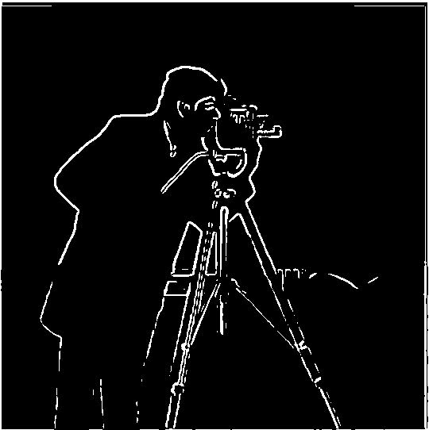
    <figcaption>Binarized normalized magnitude image</figcaption>
  </figure>

# Part 2: Fun with Frequencies

## 2.1 Image "Sharpening"

In this section, all Gaussian filters are with the kernel same as before (the size is $7\times 7$ and the sigma is $\sigma=1$).

### 2.1.1 Sharpening Progression

By adding the high frequency components with a coefficient $\alpha$, where the high frequency components are produced from subtracting the Gaussian-blurred image, we get the sharpened images. Also by the properties of convolution, we have
$$
A+\alpha(A-A*G)=A*[(1+\alpha)I-\alpha G],
$$
which means we can use one filter (called **unsharp mask filter**) with the expression $(1+\alpha)I-\alpha G$ where $I$ is the identical operator to sharpen the image w.r.t. the parameter $\alpha$.

We choose a set of $\alpha$'s, and show the progressive process of sharpening as follows:

  <figure style="text-align: center; margin: 10px;">
    
    <figcaption>Taj Mahal (original, alpha=0)</figcaption>
  </figure>
  <figure style="text-align: center; margin: 10px;">
    
    <figcaption>Taj Mahal (alpha=0.5)</figcaption>
  </figure>
  <figure style="text-align: center; margin: 10px;">
    
    <figcaption>Taj Mahal (alpha=0.9)</figcaption>
  </figure>
  <figure style="text-align: center; margin: 10px;">
    
    <figcaption>Taj Mahal (alpha=1.5)</figcaption>
  </figure>

  <figure style="text-align: center; margin: 10px;">
    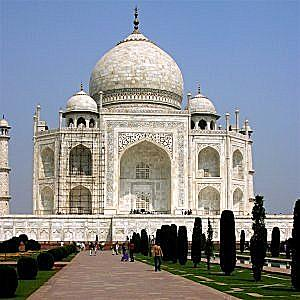
    <figcaption>Taj Mahal (alpha=2)</figcaption>
  </figure>
  <figure style="text-align: center; margin: 10px;">
    
    <figcaption>Taj Mahal (alpha=6)</figcaption>
  </figure>
  <figure style="text-align: center; margin: 10px;">
    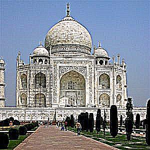
    <figcaption>Taj Mahal (alpha=10)</figcaption>
  </figure>

We can see the edge (patterns) of this beautiful architecture is more and more obvious in the progression when $\alpha$ is increasing.

Also for my self-chosen image of a famous wall taken in Shimo-Kitazawa, Tokyo:

  <figure style="text-align: center; margin: 10px;">
    
    <figcaption>Wall (original, alpha=0)</figcaption>
  </figure>
  <figure style="text-align: center; margin: 10px;">
    
    <figcaption>Wall (alpha=0.5)</figcaption>
  </figure>
  <figure style="text-align: center; margin: 10px;">
    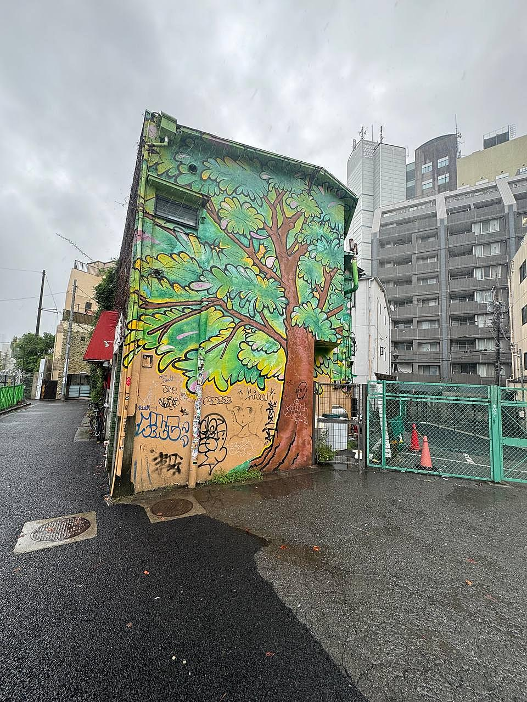
    <figcaption>Wall (alpha=0.9)</figcaption>
  </figure>
  <figure style="text-align: center; margin: 10px;">
    
    <figcaption>Wall (alpha=1.5)</figcaption>
  </figure>

  <figure style="text-align: center; margin: 10px;">
    
    <figcaption>Wall (alpha=2)</figcaption>
  </figure>
  <figure style="text-align: center; margin: 10px;">
    
    <figcaption>Wall (alpha=6)</figcaption>
  </figure>
  <figure style="text-align: center; margin: 10px;">
    
    <figcaption>Wall (alpha=10)</figcaption>
  </figure>

### 2.1.2 Sharpening after Blurring

For the Taj Mahal image, we try first blurring the image, then sharpen the blurred using a filter with $\alpha=3$.

  <figure style="text-align: center; margin: 10px;">
    
    <figcaption>Taj Mahal (original)</figcaption>
  </figure>
  <figure style="text-align: center; margin: 10px;">
    
    <figcaption>Taj Mahal (blurred)</figcaption>
  </figure>
  <figure style="text-align: center; margin: 10px;">
    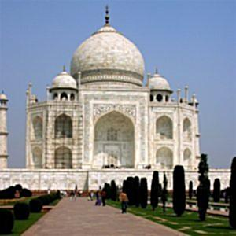
    <figcaption>Taj Mahal (sharpened after blurred, alpha=1.5)</figcaption>

After being blurred, the image seems like being veiled, and re-sharpening removes this effect, but the resolution seems lower than the original, because there are some high frequency components (featuring high resolution) whose frequencies higher than the Nyquist limit in the original image is blurred by the LP filter, which is not able to be reconstruct (and also causes aliasing).

## 2.2 Hybrid Images

The general approach for creating a hybrid images involves these:

1. Align two images by rescaling, rotating and shifting;
2. Get the low frequency part of one image using a LP filter (we choose a Gaussian here though);
3. Get the low frequency of another using probably another LP filter (this could be different from that in 2), and get the high frequency part by subtracting the original image with the low frequency part. This can also be reached with a Laplacian filter.

For all cases below, we all choose a square kernel with the width/height 7 times of the sigma for each Gaussian filter.

We show two successful cases of creating hybrid images, and one failure.

### 2.2.1 Result 1

The sigma for the image for low frequency is `sigma_lo=5`. The other sigma is `sigma_hi=3`.

  <figure style="text-align: center; margin: 10px;">
    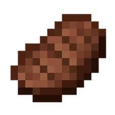
    <figcaption>yajuusteak/steak.jpg   Minecraft Steak (for low frequency)</figcaption>
  </figure>
  <figure style="text-align: center; margin: 10px;">
    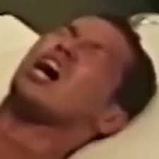
    <figcaption>yajuusteak/yajuu.jpg   Some shouting male (for high frequency)</figcaption>
  </figure>

  <figure style="text-align: center; margin: 10px;">
    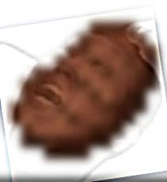
    <figcaption>Hybrid image: Steak shouting</figcaption>
  </figure>

### 2.2.2 Result 2

  <figure style="text-align: center; margin: 10px;">
    
    <figcaption>emoji/savor.jpg   Savoring Emoji (for low frequency)</figcaption>
  </figure>
  <figure style="text-align: center; margin: 10px;">
    
    <figcaption>emoji/fear.jpg   Fearing Emoji (for high frequency)</figcaption>
  </figure>

  <figure style="text-align: center; margin: 10px;">
    
    <figcaption>Hybrid image</figcaption>
  </figure>

At first sight I could see the fear, nonetheless focusing less and the joy hidden behind will emerge.

We do Fourier transform to these original (aligned), filtered images and the hybrid image.

  <figure style="text-align: center; margin: 10px;">
    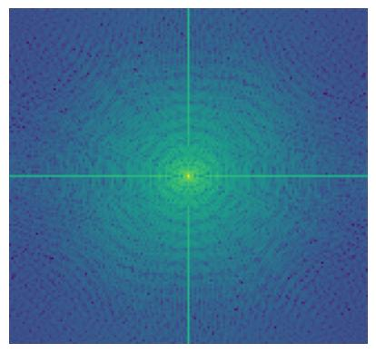
    <figcaption>The FT visualization for savor.jpg</figcaption>
  </figure>
  <figure style="text-align: center; margin: 10px;">
    
    <figcaption>The FT visualization for fear.jpg</figcaption>
  </figure>

  <figure style="text-align: center; margin: 10px;">
    
    <figcaption>The FT visualization for savor.jpg low frequency components (filtered)</figcaption>
  </figure>
  <figure style="text-align: center; margin: 10px;">
    
    <figcaption>The FT visualization for fear.jpg high frequency components (filtered)</figcaption>
  </figure>

  <figure style="text-align: center; margin: 10px;">
    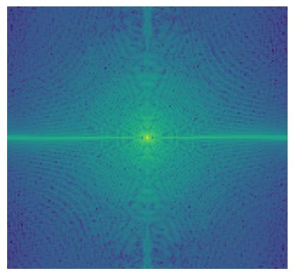
    <figcaption>The FT visualization for the hybrid image</figcaption>
  </figure>

### 2.2.3 Result 3 (Failed)

  <figure style="text-align: center; margin: 10px;">
    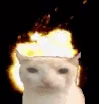
    <figcaption>cat/explo.jpg   Exploding Cat (for low frequency)</figcaption>
  </figure>
  <figure style="text-align: center; margin: 10px;">
    
    <figcaption>cat/eat.jpg   Eating Cat (for high frequency)</figcaption>
  </figure>

  <figure style="text-align: center; margin: 10px;">
    
    <figcaption>Hybrid Image, but I think it's failed.</figcaption>
  </figure>

Though it mix well, but we could percept two features at the same time, for which I think it's a failure. I think it's because the original images are in low resolution, and the main feature (the cat) overlaps too perfectly with no other to-be-overlapped features which could make this be called a hybrid image.

## 2.3 Gaussian and Laplacian Stacks
In a Gaussian stack, we have the first image as the original image, and the every next image is the result of the last image in the stack convoluted with a Gaussian filter. In a Laplacian stack, every image with index `i` except the last one is the difference between the image `i` in the Gaussian stack and the next image `i+1` in the Gaussian stack, and the last image is the same as the last image in the Gaussian stack which can make the whole stack adding up to the original image.

With help of the Gaussian and Laplacian stacks, we can smoothly **blend** the parts of two images together instead of Alpha blending (interpolating the pixel values of two images with a weight). In detail, for images `A` and `B`, we have the Gaussian stack `G_A` and `G_B`, and the Laplacian stack `L_A` and `L_B`, also the mask `M` (a binary image with the same size as `A` and `B`), for which we also build a Gaussian stack `G_M`. The blended image `C` is the collapsed (summed) every layer of two Laplacian stacks added together interpolated w.r.t. the mask extracted from the same layer index in `G_M`.

In implementation, for the Oraple we have 6-level stacks. Sigmas are always 5 and the kernel size is 7 times of that.

    Level 0
  <figure style="text-align: center; margin: 10px;">
    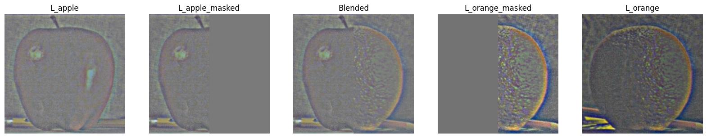
  </figure>

    Level 1
  <figure style="text-align: center; margin: 10px;">
    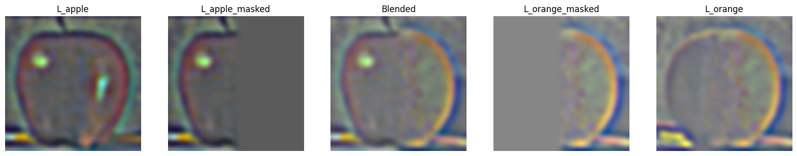
  </figure>

    Level 2
  <figure style="text-align: center; margin: 10px;">
    
  </figure>

    Level 3
  <figure style="text-align: center; margin: 10px;">
    
  </figure>

    Level 4
  <figure style="text-align: center; margin: 10px;">
    
  </figure>

    Level 5
  <figure style="text-align: center; margin: 10px;">
    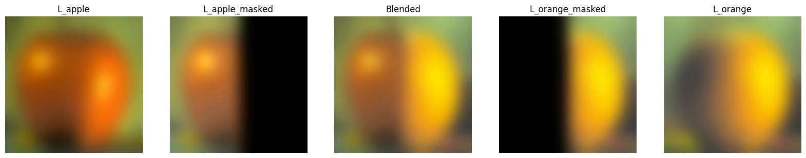
  </figure>

    Sum-up
  <figure style="text-align: center; margin: 10px;">
    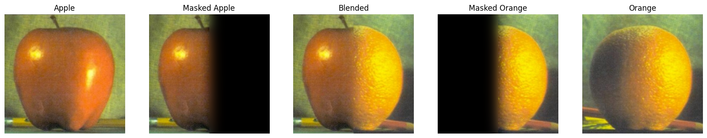
  </figure>

  <figure style="text-align: center; margin: 10px;">
    
    <figcaption> The oraple </figcaption>
  </figure>

## 2.4 Multi-resolution Blending

Given the approach of blending introduced in 2.3, we could blend any pair of images with some masks. The sigma/kernel/level number settings remain from 2.3.

When generating masks, I used **[Segment-Anything by Meta](https://segment-anything.com/demo)** to cut out an transparent-background sub-image (which is a feature) from one photo I have taken, and manipulated the shifting and resizing by hand.

### 2.4.1 Statue of Hachiko ~~the Squirrel~~

+ Sigma for the squirrel: 7
+ Sigma for the Hachiko statue: 13
+ Sigma for the Gaussian stack: 7
+ Kernel size: 7*sigma
+ Number of levels for the stacks: 8

  <figure style="text-align: center; margin: 10px;">
    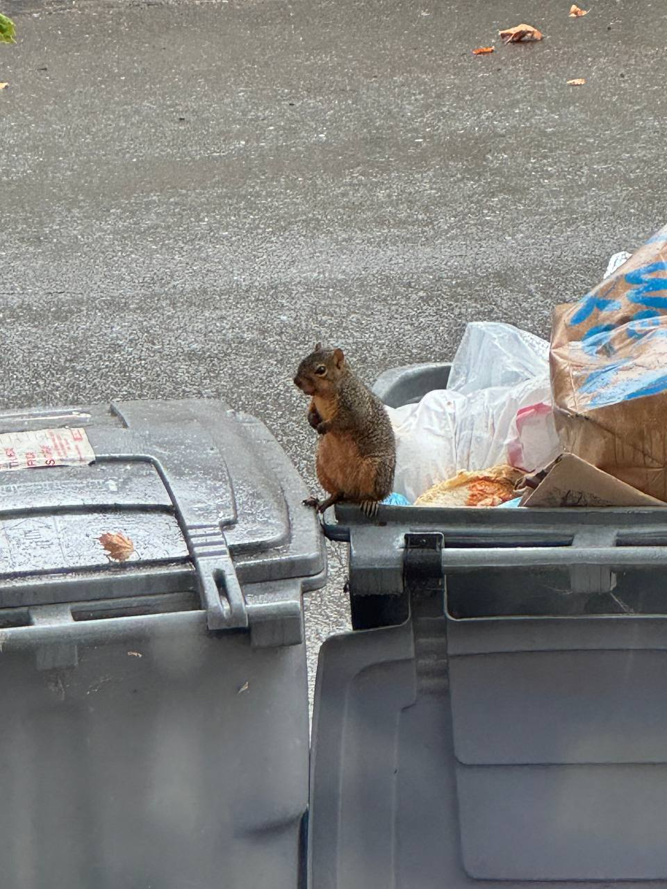
    <figcaption>squirrel_original.jpg</figcaption>
  </figure>
  <figure style="text-align: center; margin: 10px;">
    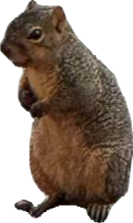
    <figcaption>squirrel.png (Cut out by Segment-anything)</figcaption>
  </figure>

          <figure style="text-align: center; margin: 10px;">
    
    <figcaption>hachiko.jpg</figcaption>
  </figure>
      <figure style="text-align: center; margin: 10px;">
    
    <figcaption>squirrel_changed.jpg (Shifted and Resized)</figcaption>
  </figure>

  <figure style="text-align: center; margin: 10px;">
    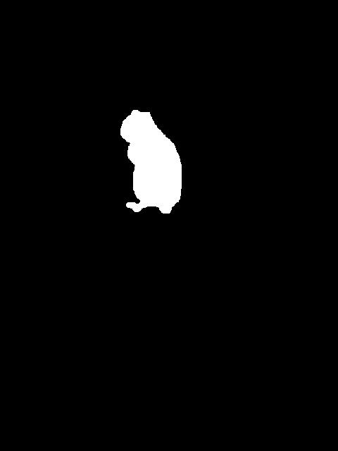
    <figcaption>Mask</figcaption>
  </figure>
  <figure style="text-align: center; margin: 10px;">
    
    <figcaption>Blended Image</figcaption>
  </figure>

### 2.4.2 Extra Chashu to My Ramen

(but only 1 piece in 2)

+ Sigma for every stack: 7
+ Kernel size: 7*sigma
+ Number of levels for the stacks: 8

  <figure style="text-align: center; margin: 10px;">
    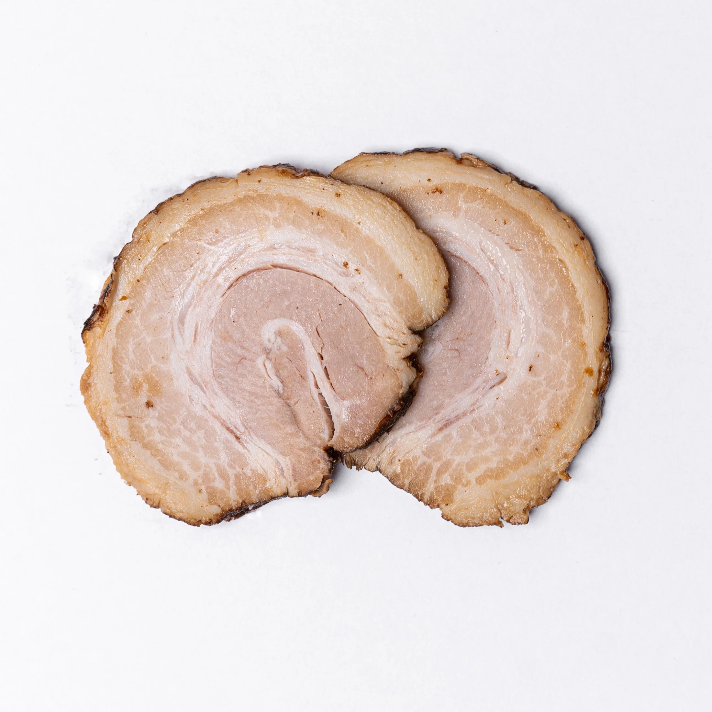
    <figcaption>chashu_original.jpg</figcaption>
  </figure>
  <figure style="text-align: center; margin: 10px;">
    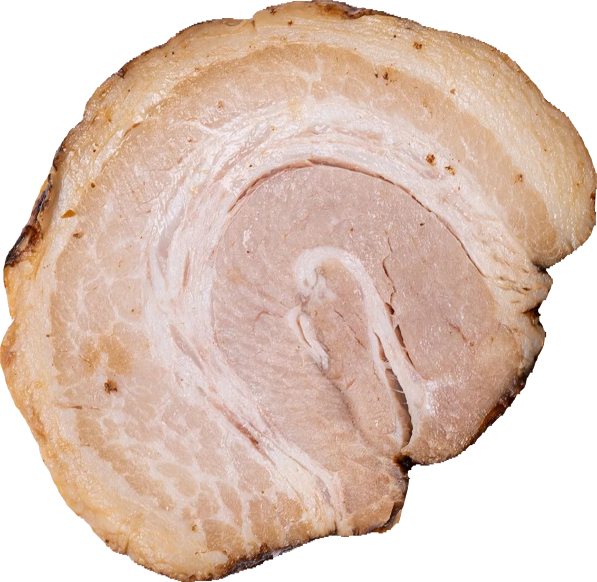
    <figcaption>chashu.png (Cut out by Segment-anything)</figcaption>
  </figure>

  <figure style="text-align: center; margin: 10px;">
    
    <figcaption>ramen.jpg</figcaption>
  </figure>
  <figure style="text-align: center; margin: 10px;">
    
    <figcaption>chashu_changed.jpg (Shifted and Resized)</figcaption>
  </figure>

  <figure style="text-align: center; margin: 10px;">
    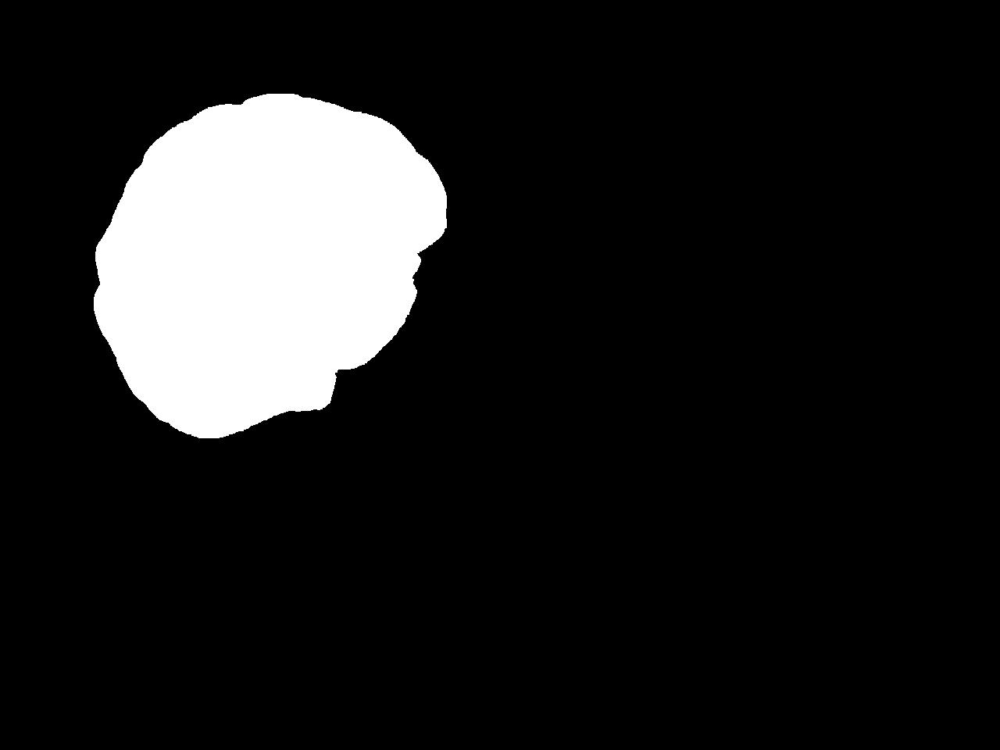
    <figcaption>Mask</figcaption>
  </figure>
  <figure style="text-align: center; margin: 10px;">
    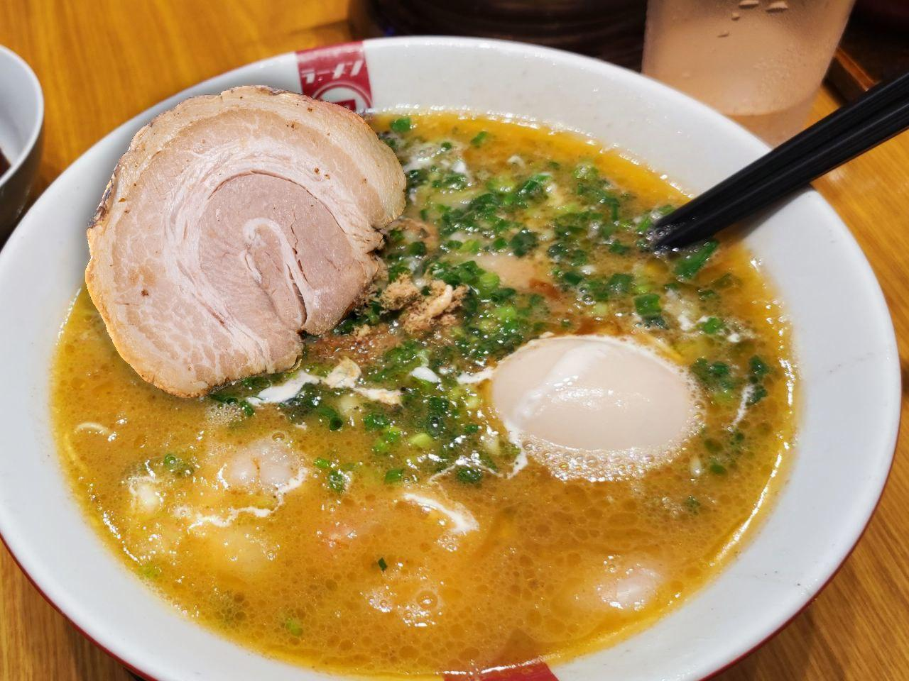
    <figcaption>Blended Image</figcaption>
  </figure>

The chashu blended into the noodles seems smooth, especially for the shadow appears at the upper part (which is not in the cut-out image and the black-background image) and the lower part is colored by the soup.

The Laplacian/Gaussian Stacks before/after masking is as shown as below.

    Level 0
  <figure style="text-align: center; margin: 10px;">
    
  </figure>

    Level 1
  <figure style="text-align: center; margin: 10px;">
    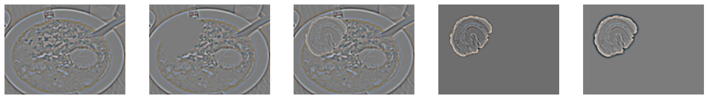
  </figure>

    Level 2
  <figure style="text-align: center; margin: 10px;">
    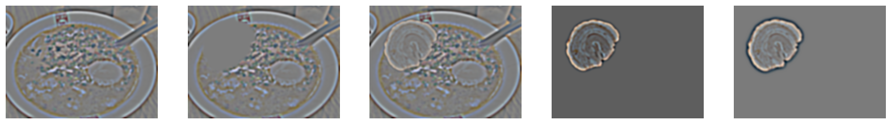
  </figure>

    Level 3
  <figure style="text-align: center; margin: 10px;">
    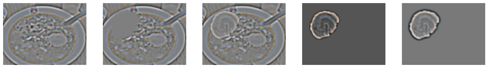
  </figure>

    Level 4
  <figure style="text-align: center; margin: 10px;">
    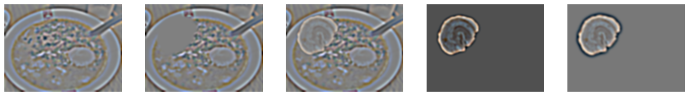
  </figure>

    Level 5
  <figure style="text-align: center; margin: 10px;">
    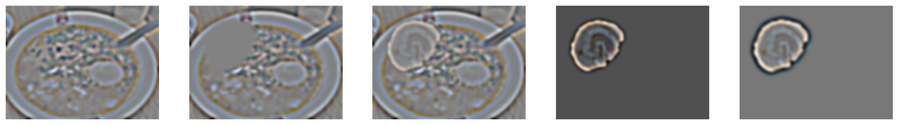
  </figure>

    Level 6
  <figure style="text-align: center; margin: 10px;">
    
  </figure>

    Level 7
  <figure style="text-align: center; margin: 10px;">
    
  </figure>

    Sum Up
  <figure style="text-align: center; margin: 10px;">
    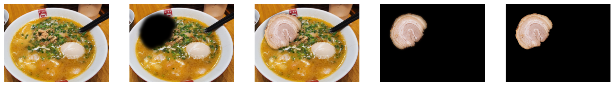
  </figure>

