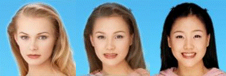
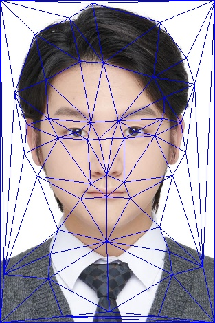
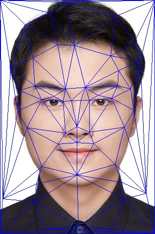
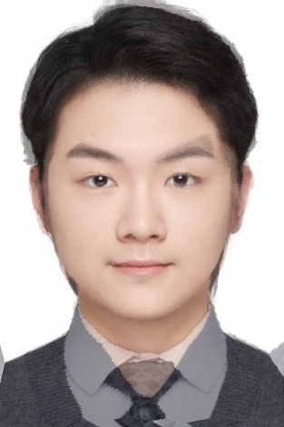
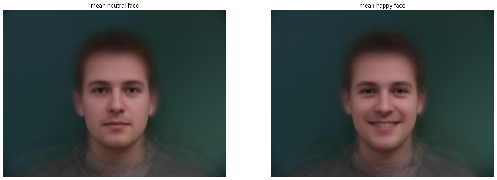
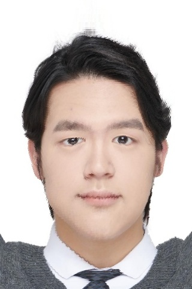
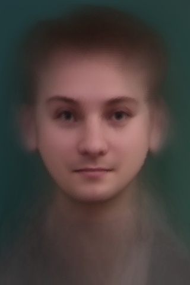

## Programming Project #3 (`proj3`)

*COMPSCI 180 [Intro to Computer Vision and Computational Photography](https://inst.eecs.berkeley.edu/~cs180/fa24/)*

Chuyan Zhou

This webpage uses the Typora **Newsprint** theme of markdown files.

# Part 1: Defining Correspondences

We first crop the size of two images to the same. And then we use the website [here](https://cal-cs180.github.io/fa23/hw/proj3/tool.html) to get the correspondence point pairs. There are 48 pairs of points in total. 

We add four corners of the image to the correspondence point pairs. So there are 52 pairs of points in total.

  <figure style="text-align: center; margin: 10px;">
    
    <figcaption>My face with correspondence points</figcaption>
  </figure>
  <figure style="text-align: center; margin: 10px;">
    
    <figcaption>My friend Junye's face with correspondence points</figcaption>
  </figure>

Now that we have got the correspondence point pairs, we create a mean set of points by averaging the x and y coordinates of the correspondence point pairs.

Then, we create a Delaunay triangulation of the mean set of points. The triangulation should be in the form of a list of connected points.

  <figure style="text-align: center; margin: 10px;">
    
    <figcaption>My face with Delaunay triangulation</figcaption>
  </figure>
  <figure style="text-align: center; margin: 10px;">
    
    <figcaption>My friend Junye's face with Delaunay triangulation</figcaption>
  </figure>

# Part 2: The mid-way face

We now have `im1` and `im2` as the two images, and the `im1_pts` and `im2_pts` as the correspondence point pairs.

Also, we have the Delaunay triangulation of the mean set of points.

We first create the mid-way shape by averaging the x and y coordinates of the correspondence point pairs. Given we have computed the `mean_pts` in Part 1, this works as the mid-way shape.

Then, we create the mid-way face by warping the two images to the mid-way shape, using the Delaunay triangulation given in Part 1.

Specifically, for every pixel from the original two images, we do an affine transformation to the mid-way shape, and then use the pixel value at the transformed location as the pixel value of the mid-way face.

  <figure style="text-align: center; margin: 10px;">
    
    <figcaption>Mid-way Face</figcaption>
  </figure>

# Part 3: The morph sequence

We extend Part 2 to a parameterized morph sequence, where every morphed image is controlled by a dissolve fraction and a warp fraction, both in $[0,1]$. I equally separate the interval into 31 values, which means the gif output will be 31 fps.

  <figure style="text-align: center; margin: 10px;">
    
    <figcaption>Morph sequence</figcaption>
  </figure>

**# Part 4: The "Mean face" of a population**

We first read the whole dataset of Dane faces, load the images and parse the corresponding points from `asf` files.

Then, we create a mean shape for the population.

Actually, I choose the mean shape of neutral faces and happy faces, and morphed 3 examples of each subset to the mean respectively.

  <figure style="text-align: center; margin: 10px;">
    
    <figcaption>3 warp example of neutral faces (shape-only)</figcaption>
  </figure>

  <figure style="text-align: center; margin: 10px;">
    
    <figcaption>3 warp example of happy faces (shape-only)</figcaption>
  </figure>

The average face of neutral, happy and all faces in the dataset is shown below:

  <figure style="text-align: center; margin: 10px;">
    
    <figcaption>Mean face of neutral and happy faces</figcaption>
  </figure>

  <figure style="text-align: center; margin: 10px;">
    
    <figcaption>Mean face of the whole dataset</figcaption>
  </figure>

Also, I create the warp from mean face to me and me to the mean face (shape-only):

  <figure style="text-align: center; margin: 10px;">
    
    <figcaption>Me to average Dane</figcaption>
  </figure>
  <figure style="text-align: center; margin: 10px;">
    
    <figcaption>Average Dane to me</figcaption>
  </figure>

It seems not so normal, which can be due to the blurry outline of the Average Dane image.

**# Part 5: Caricatures: Extrapolating from the mean**

We can extrapolate from the source face to the destination face by a factor of $\alpha$.

Specifically, we let the shape of the extrapolated face be:

$$
\text{shape} = \text{source shape} + \alpha \times (\text{destination shape} - \text{source shape})\\
= (1 - \alpha) \times \text{source shape} + \alpha \times \text{destination shape}
$$

and the appearance is kept the same as the source face.

If we set $\alpha > 1$, we can get the caricature of the source face towards the characteristics of the destination face.

We set $\alpha = 1.5$ and try caricature towards the mean face of happy Dane faces.

  <figure style="text-align: center; margin: 10px;">
    
    <figcaption>Me</figcaption>
  </figure>
  <figure style="text-align: center; margin: 10px;">
    
    <figcaption>Average Happy Dane</figcaption>
  </figure>
  <figure style="text-align: center; margin: 10px;">
    
    <figcaption>Me happily extrapolated (shape only)</figcaption>
  </figure>

Because I didn't show my teeth when taking this photo, only my mouth lips are stretched. Also because the blurry outline of the average image, the correspondence is more difficult, and also the extrapolated image seems unnatural in the outline.

# Part 6: Bells and Whistles

## 6.1: Gender changing

We can change from my face to a female face by

1. first compute the mean shape of female faces,
2. morph my face to the mean via a pair of dissolve and warp fractions.

This seems giving a pretty good effect when the fractions are within $[0,1]$ as follows:

  <figure style="text-align: center; margin: 10px;">
    
    <figcaption>Me</figcaption>
  </figure>
  <figure style="text-align: center; margin: 10px;">
    
    <figcaption>Average Female Dane Face</figcaption>
  </figure>
  <figure style="text-align: center; margin: 10px;">
    
    <figcaption>Gender changed</figcaption>
  </figure>

