## Programming Project #4 (`proj4`)

*COMPSCI 180 [Intro to Computer Vision and Computational Photography](https://inst.eecs.berkeley.edu/~cs180/fa24/)*

Chuyan Zhou

This webpage uses the Typora **Newsprint** theme of markdown files.

# Part A

## 1. Shoot the pictures

I took two pictures of one place in my Minecraft world. It's visible that the two pictures have different perspectives, and there is a projective relationship between the two pictures, especially embodied on the surface of the main building. The two pictures are shown below:

  <figure style="text-align: center; margin: 10px;">
    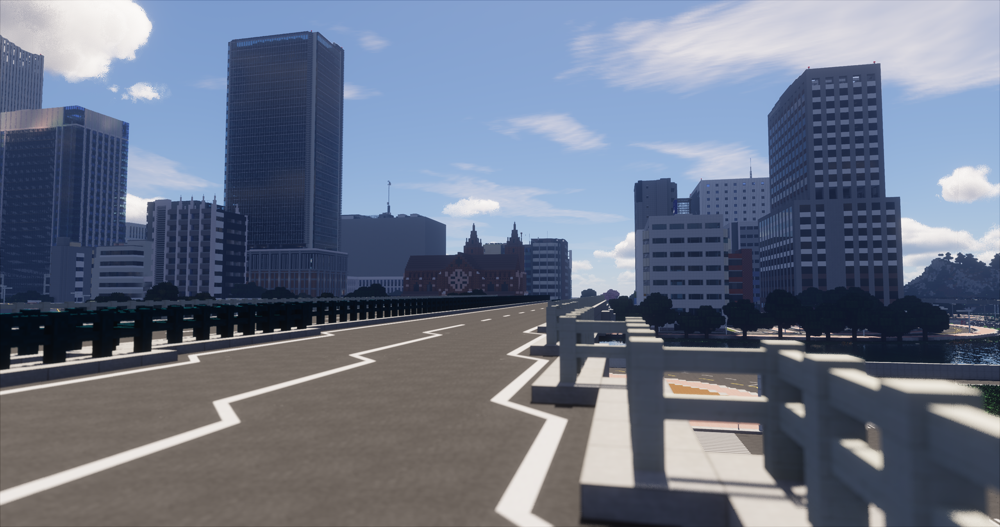
      <figcaption>Image 1</figcaption>
  </figure>
  <figure style="text-align: center; margin: 10px;">
    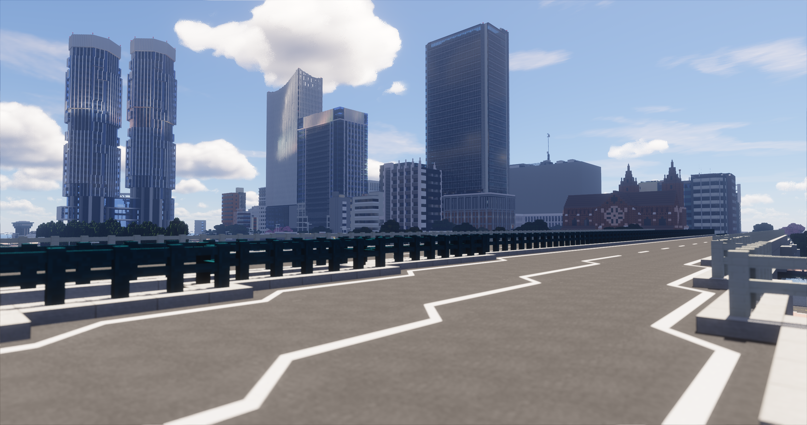
    	<figcaption>Image 2</figcaption>
  </figure>

  <figure style="text-align: center; margin: 10px;">
    
      <figcaption>Correspondence points in Image 1</figcaption>
  </figure>
  <figure style="text-align: center; margin: 10px;">
    
      <figcaption>Correspondence points in Image 2</figcaption>
  </figure>

I think the effort of configuring & taking photos in **games** with perspective properties may be seen as one kind of B&W in the "own idea" section.

## 2. Recover Homographies
Given there is a projective relationship between these two images, we know that we can use a homography matrix $H$ to transform the points in one image to the other. More technically, the homography matrix can work as a transformation matrix to warp the points in one image to the other. Here is the mathmatical model of the homography matrix:

Given a point $p = (x, y)^T$ in the first image, and its corresponding point $p' = (wx', wy')^T$ in the second image, we have the following equation:
$$
\begin{bmatrix}
wx' \\
wy' \\
w
\end{bmatrix}
= H
\begin{bmatrix}
x \\
y \\
1
\end{bmatrix}
\iff
\begin{bmatrix}
p' \\
w
\end{bmatrix}
= H
\begin{bmatrix}
p \\
1
\end{bmatrix}
$$
where $H$ is a $3 \times 3$ matrix modeled as:
$$
H = \begin{bmatrix}
a & b & c \\
d & e & f \\
g & h & 1
\end{bmatrix}
$$
having 8 degrees of freedom and $w$ is the scaling factor. We can transform the above equation into the following form:
$$
h=[a,b,c,d,e,f,g,h]^T
$$
and the transformation equation can be expanded as
$$
\begin{cases}
wx' & = ax + by + c \\
wy' & = dx + ey + f \\
w & = gx + hy + 1
\end{cases}
\iff
\begin{cases}
(gx + hy + 1)x' & = ax + by + c \\
(gx + hy + 1)y' & = dx + ey + f,
\end{cases}
$$
which can be collapsed into $Ah = b$ form as
$$
\begin{bmatrix}
x & y & 1 & 0 & 0 & 0 & -x'x & -x'y \\
0 & 0 & 0 & x & y & 1 & -y'x & -y'y
\end{bmatrix}
h
=
\begin{bmatrix}
x' \\
y'
\end{bmatrix}:=b
$$
where $A$ is a $2 \times 8$ matrix, $h$ is a $8 \times 1$ vector, and $b$ is a $2 \times 1$ vector. By stacking $4$ pairs of points into $A$,
there is a guaranteed solution to the above equation. If we have more than $4$ pairs of points, we can use the least square method to solve the equation as a overdetermined system:
$$
\min_{h} ||Ah - b||^2
$$

## 3. Warp the images

After we have the homography matrix $H$, we can warp the points in one image to the other. The warping process can be done by the following steps:

1. For each pixel in the target image, we can use the homography matrix to find its corresponding pixel in the source image.
2. We can use the bilinear interpolation to find the values for the non-integer pixel positions in the source image.

Because there are negative pixel positions in the source image, we can use a translation matrix $T$ for both images to make a good alignment.

We warp image 1 to 2 now.

  <figure style="text-align: center; margin: 10px;">
    
      <figcaption>Image 2 (Reference), scaled and shifted</figcaption>
  </figure>
  <figure style="text-align: center; margin: 10px;">
    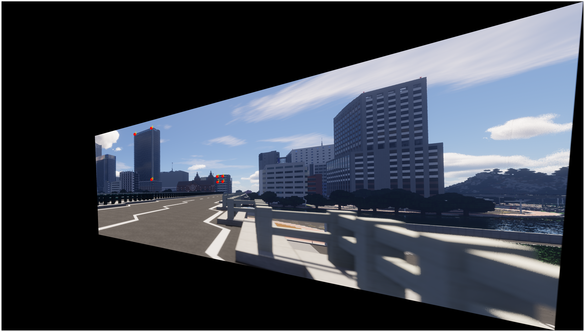
    	<figcaption>Image 1 (Warped)</figcaption>
  </figure>

Here is the version without the correspondence points:

  <figure style="text-align: center; margin: 10px;">
    
      <figcaption>Image 1 (Warped)</figcaption>
  </figure>

## 4. Image Rectification

In this part, we choose 4 points from one original image, and warp the image to make the 4 points become a rectangle.

### 4.1 Rectified Image 1

  <figure style="text-align: center; margin: 10px;">
    
      <figcaption>Original Image</figcaption>
  </figure>
  <figure style="text-align: center; margin: 10px;">
    
      <figcaption>Original Image, marked with corresponding points</figcaption>
  </figure>  

  <figure style="text-align: center; margin: 10px;">
    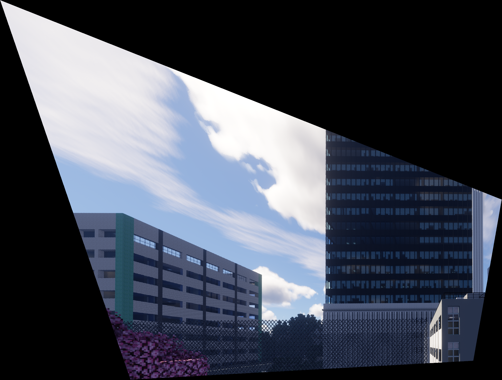
      <figcaption>Rectified Image</figcaption>
  </figure>
  <figure style="text-align: center; margin: 10px;">
    
      <figcaption>Rectified Image, marked with corresponding points</figcaption>
  </figure>  

A large rectified image as above:

  <figure style="text-align: center; margin: 10px;">
    
      <figcaption>Rectified Image (shown again)</figcaption>
  </figure>

### 4.2 Rectified Image 2

  <figure style="text-align: center; margin: 10px;">
    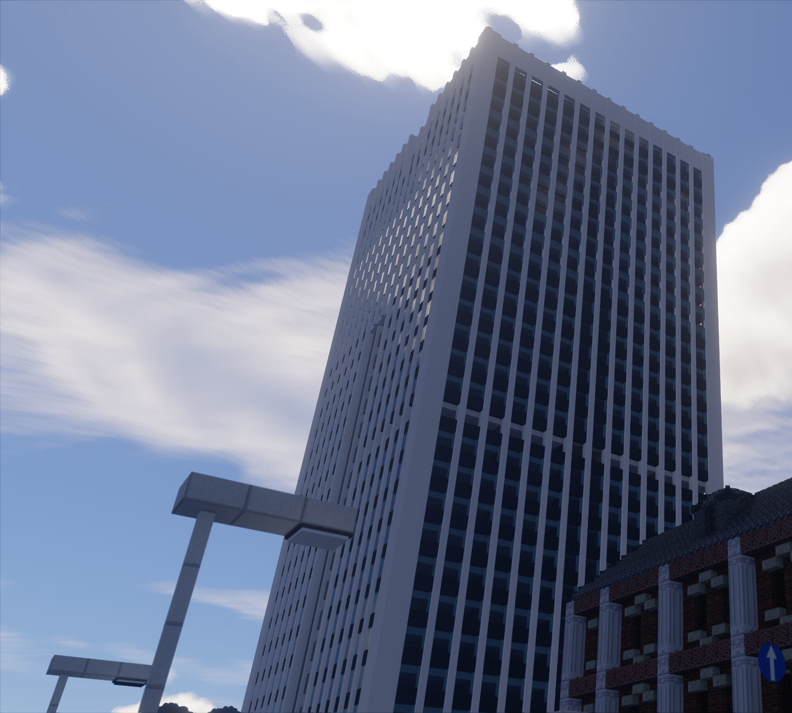
      <figcaption>Original Image</figcaption>
  </figure>
  <figure style="text-align: center; margin: 10px;">
    
      <figcaption>Original Image, marked with corresponding points</figcaption>
  </figure>  

  <figure style="text-align: center; margin: 10px;">
    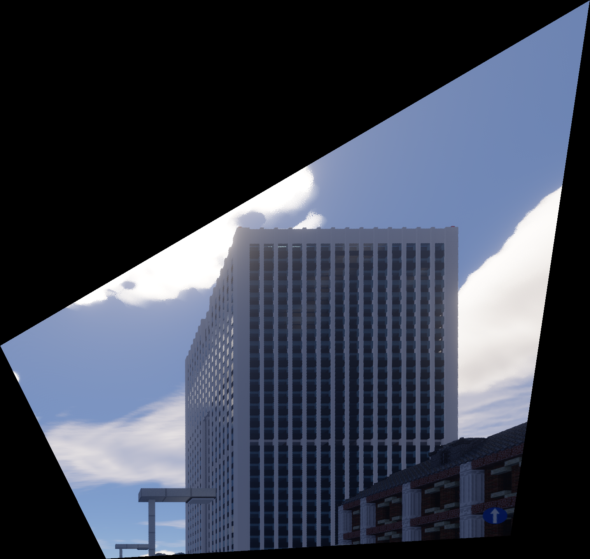
      <figcaption>Rectified Image</figcaption>
  </figure>
  <figure style="text-align: center; margin: 10px;">
    
      <figcaption>Rectified Image, marked with corresponding points</figcaption>
  </figure>  

  <figure style="text-align: center; margin: 10px;">
    
      <figcaption>Rectified Image (shown again)</figcaption>
  </figure>

## 5. Blend the images into a mosaic

In this part, we blend the two images mentioned in part 2 and 3 into a mosaic. For a 2-image system to get a mosaic (which is not more, and is our case), we first warp the two images into the same coordinate system, and then blend the two images into one. 

### 5.1 Alpha Blending

First, we use linear blending to blend the two images, a.k.a. Alpha blending, which is basically set 0.5 in the overlapping region of both masks and make the weighted sum.

  <figure style="text-align: center; margin: 10px;">
    
      <figcaption>Image 1 (Warped)</figcaption>
  </figure>
  <figure style="text-align: center; margin: 10px;">
    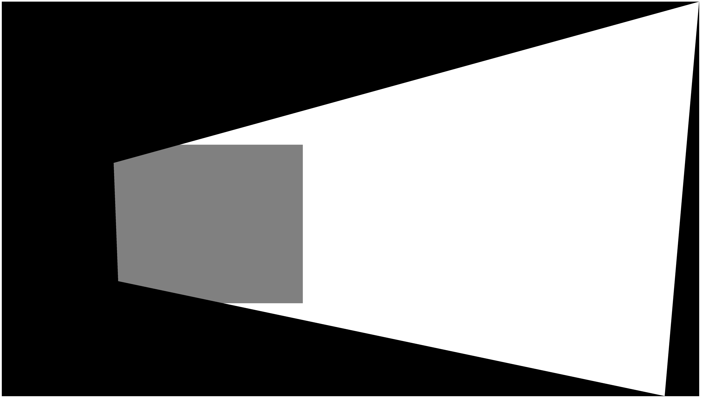
      <figcaption>Alpha-blending Mask for Image 1</figcaption>
  </figure>  

  <figure style="text-align: center; margin: 10px;">
    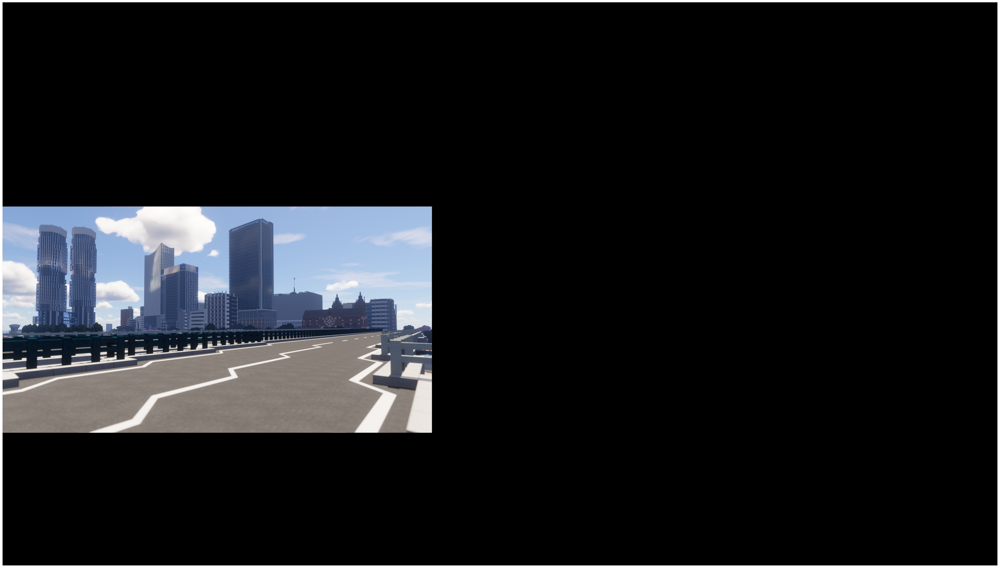
      <figcaption>Image 2 (Scaled and Shifted)</figcaption>
  </figure>
  <figure style="text-align: center; margin: 10px;">
    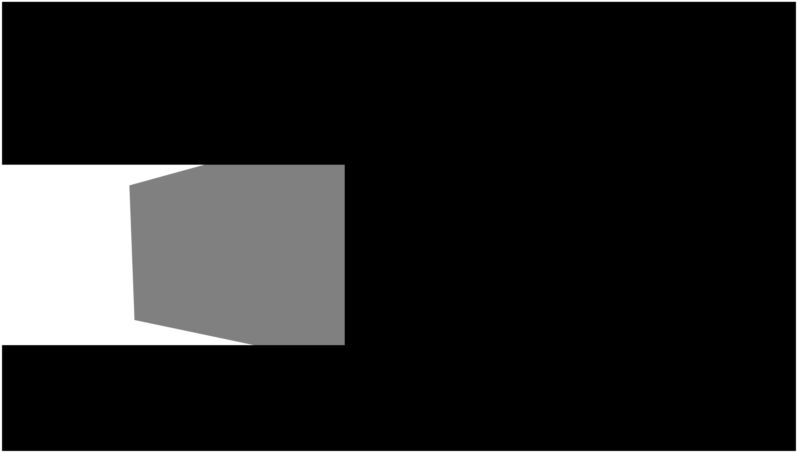
      <figcaption>Alpha-blending Mask for Image 2</figcaption>
  </figure>  

  <figure style="text-align: center; margin: 10px;">
    
      <figcaption>Alpha-blended Image</figcaption>
  </figure> 

However, we can observe apparent artifacts in the edges of the images.

We can use methods such as Laplacian Pyramid and Distance Transform.

### 5.2 Distance Transform

We can see the two images are not perfectly aligned because of different illumination/exposure conditions and (possibly) correspondence by hand. We can see some artifacts in the final mosaic image. 

So we could use the distance transform method to blend the two images. The distance transform method is to calculate the distance of each pixel of each mask to the nearest edge (nearest zero pixel of the mask) of the two images, and blend the two images based on the distance. The closer the pixel to the edge, the more weight it will have in the blending process.

Here is step-by-step code to blend the two images using the distance transform method:
1. Calculate the distance of each mask to the nearest zero pixel of the mask. Let the mask be $M$:
   $$
   D_k(x, y) \gets \min_{M(x', y') = 0} \sqrt{(x - x')^2 + (y - y')^2},k\in [n].
   $$

2. Normalize the distance map to $[0, 1]$:
   $$
   D_k(x, y) \gets \frac{D_k(x, y) - \min D_k}{\max D_k - \min D_k}, k\in [n].
   $$

3. Blend the two images based on the distance map. Let the two images be $I_1$ and $I_2$:
   $$
   I_B(x, y) \gets {\sum_{k=1}^n D_k(x, y)I_k(x, y) \over \sum_{k=1}^n D_k(x, y)}.
   $$

Here $n = 2$ in our blending process: even though we have multiple images, we can blend them one by one (pairwise) to get the final mosaic image.

  <figure style="text-align: center; margin: 10px;">
    
      <figcaption>Image 1 (Warped)</figcaption>
  </figure>
  <figure style="text-align: center; margin: 10px;">
    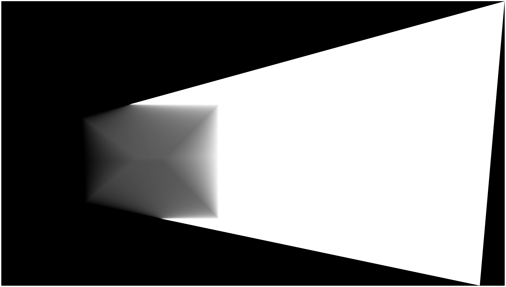
      <figcaption>DT Mask for Image 1</figcaption>
  </figure>  

<figure style="text-align: center; margin: 10px;">
    
      <figcaption>Image 2 (Scaled and Shifted)</figcaption>
  </figure>
  <figure style="text-align: center; margin: 10px;">
    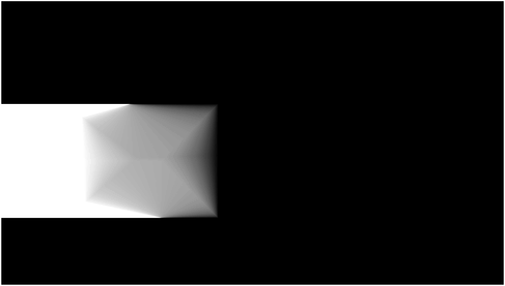
      <figcaption>DT Mask for Image 2</figcaption>
  </figure>  

  <figure style="text-align: center; margin: 10px;">
    
      <figcaption>Distance-transform-blended Image</figcaption>
  </figure> 

This seems much better.

I also implemented 3-image warping and blending.

  <figure style="text-align: center; margin: 10px;">
    
      <figcaption>Distance-transform-blended Image, but from 3 images</figcaption>
  </figure> 

### 5.3 Deliverables: 3 Mosaics

Here lays my 3 done mosaics.

#### Mosaic 1

  <figure style="text-align: center; margin: 10px;">
    
      <figcaption>Image 1</figcaption>
  </figure>
  <figure style="text-align: center; margin: 10px;">
    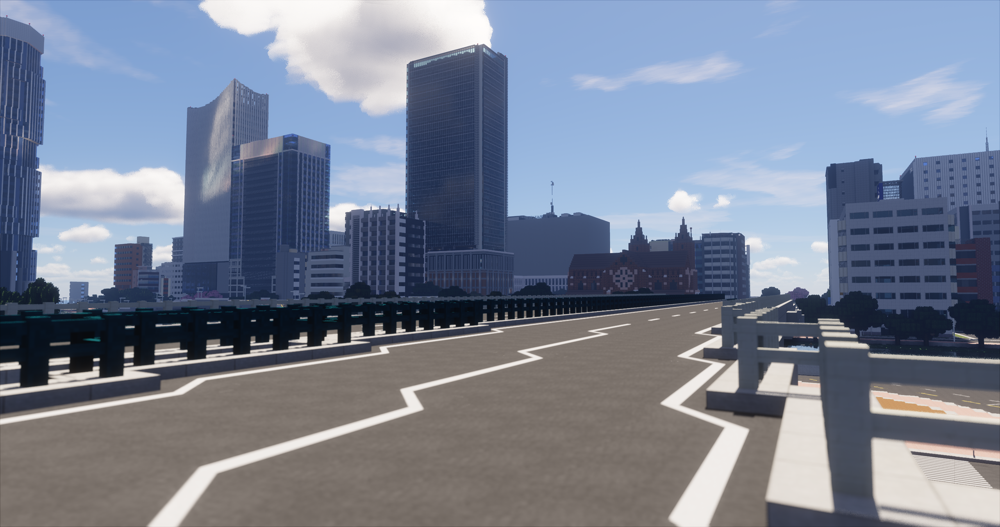
    	<figcaption>Image 2</figcaption>
  </figure>
  <figure style="text-align: center; margin: 10px;">
    
    	<figcaption>Image 3</figcaption>
  </figure>

  <figure style="text-align: center; margin: 10px;">
    
      <figcaption>Mosaic from 3 images</figcaption>
  </figure> 

#### Mosaic 2

  <figure style="text-align: center; margin: 10px;">
    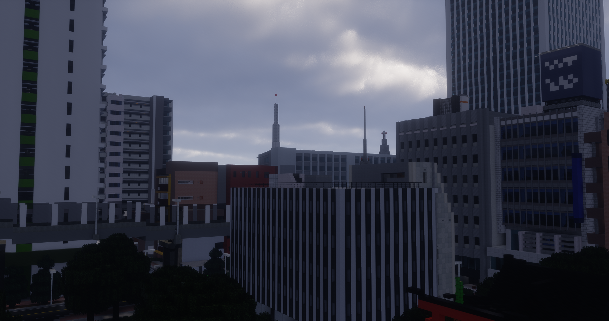
      <figcaption>Image 1</figcaption>
  </figure>
  <figure style="text-align: center; margin: 10px;">
    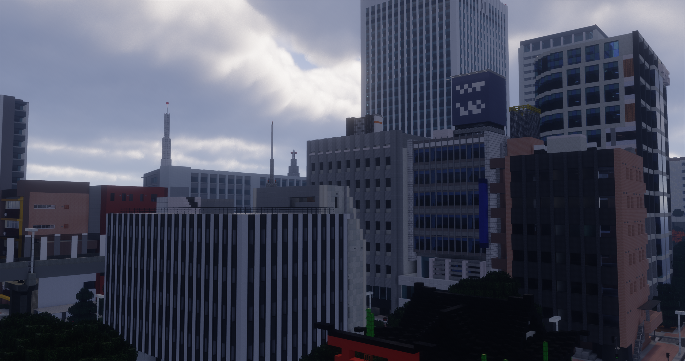
    	<figcaption>Image 2</figcaption>
  </figure>

  <figure style="text-align: center; margin: 10px;">
    
      <figcaption>Mosaic</figcaption>
  </figure> 

#### Mosaic 3

  <figure style="text-align: center; margin: 10px;">
    
      <figcaption>Image 1</figcaption>
  </figure>
  <figure style="text-align: center; margin: 10px;">
    
    	<figcaption>Image 2</figcaption>
  </figure>

  <figure style="text-align: center; margin: 10px;">
    
      <figcaption>Mosaic</figcaption>
  </figure> 

