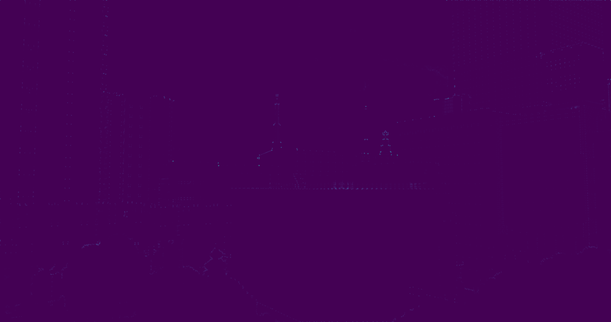
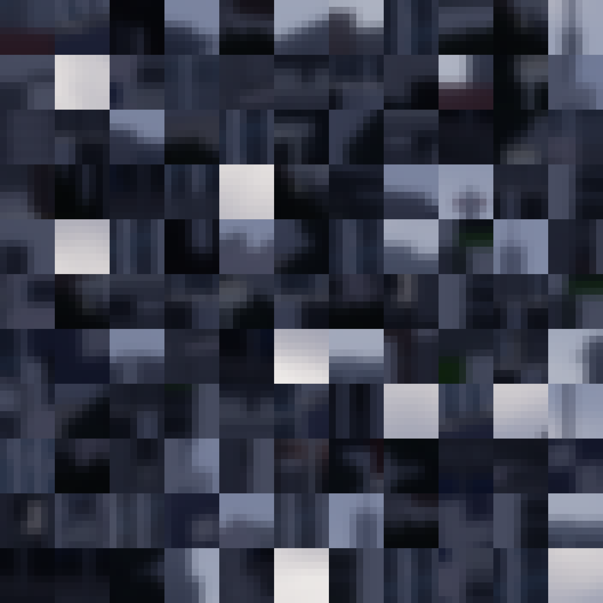
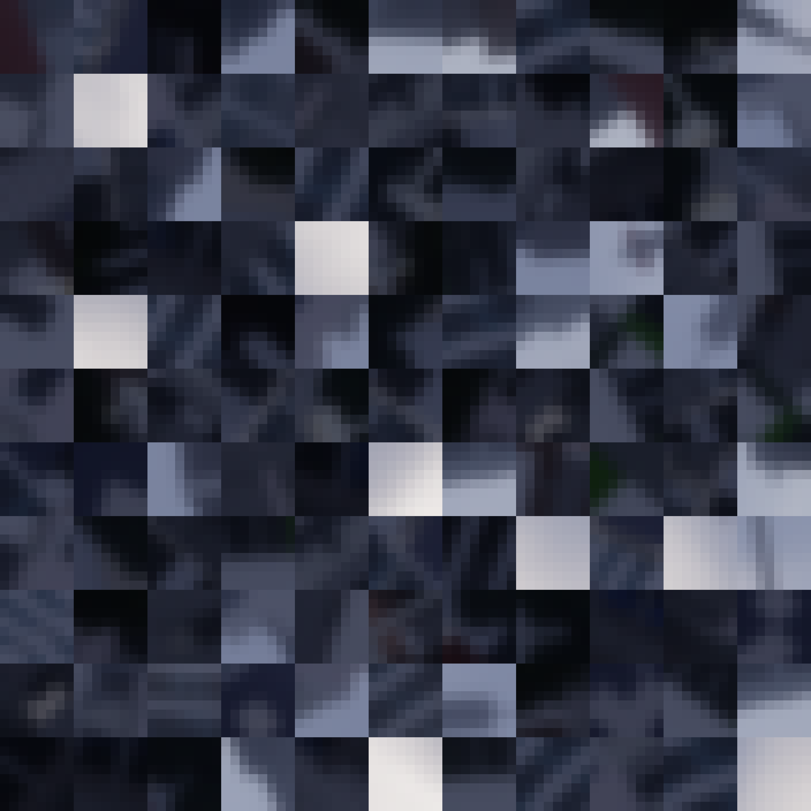

## Programming Project #4 (`proj4`)

*COMPSCI 180 [Intro to Computer Vision and Computational Photography](https://inst.eecs.berkeley.edu/~cs180/fa24/)*

Chuyan Zhou

This webpage uses the Typora **Academic** theme of markdown files.

# Part A

## 1. Shoot the pictures

I took two pictures of one place in my Minecraft world. It's visible that the two pictures have different perspectives, and there is a projective relationship between the two pictures, especially embodied on the surface of the main building. The two pictures are shown below:

  <figure style="text-align: center; margin: 10px;">
    
      <figcaption>Image 1</figcaption>
  </figure>
  <figure style="text-align: center; margin: 10px;">
    
    	<figcaption>Image 2</figcaption>
  </figure>

  <figure style="text-align: center; margin: 10px;">
    
      <figcaption>Correspondence points in Image 1</figcaption>
  </figure>
  <figure style="text-align: center; margin: 10px;">
    
      <figcaption>Correspondence points in Image 2</figcaption>
  </figure>

I think the effort of configuring & taking photos in **games** with perspective properties may be seen as one kind of B&W in the "own idea" section.

## 2. Recover Homographies
Given there is a projective relationship between these two images, we know that we can use a homography matrix $H$ to transform the points in one image to the other. More technically, the homography matrix can work as a transformation matrix to warp the points in one image to the other. Here is the mathmatical model of the homography matrix:

Given a point $p = (x, y)^T$ in the first image, and its corresponding point $p' = (wx', wy')^T$ in the second image, we have the following equation:
$$
\begin{bmatrix}
wx' \\
wy' \\
w
\end{bmatrix}
= H
\begin{bmatrix}
x \\
y \\
1
\end{bmatrix}
\iff
\begin{bmatrix}
p' \\
w
\end{bmatrix}
= H
\begin{bmatrix}
p \\
1
\end{bmatrix}
$$
where $H$ is a $3 \times 3$ matrix modeled as:
$$
H = \begin{bmatrix}
a & b & c \\
d & e & f \\
g & h & 1
\end{bmatrix}
$$
having 8 degrees of freedom and $w$ is the scaling factor. We can transform the above equation into the following form:
$$
h=[a,b,c,d,e,f,g,h]^T
$$
and the transformation equation can be expanded as
$$
\begin{cases}
wx' & = ax + by + c \\
wy' & = dx + ey + f \\
w & = gx + hy + 1
\end{cases}
\iff
\begin{cases}
(gx + hy + 1)x' & = ax + by + c \\
(gx + hy + 1)y' & = dx + ey + f,
\end{cases}
$$
which can be collapsed into $Ah = b$ form as
$$
\begin{bmatrix}
x & y & 1 & 0 & 0 & 0 & -x'x & -x'y \\
0 & 0 & 0 & x & y & 1 & -y'x & -y'y
\end{bmatrix}
h
=
\begin{bmatrix}
x' \\
y'
\end{bmatrix}:=b
$$
where $A$ is a $2 \times 8$ matrix, $h$ is a $8 \times 1$ vector, and $b$ is a $2 \times 1$ vector. By stacking $4$ pairs of points into $A$,
there is a guaranteed solution to the above equation. If we have more than $4$ pairs of points, we can use the least square method to solve the equation as a overdetermined system:
$$
\min_{h} ||Ah - b||^2
$$

## 3. Warp the images

After we have the homography matrix $H$, we can warp the points in one image to the other. The warping process can be done by the following steps:

1. For each pixel in the target image, we can use the homography matrix to find its corresponding pixel in the source image.
2. We can use the bilinear interpolation to find the values for the non-integer pixel positions in the source image.

Because there are negative pixel positions in the source image, we can use a translation matrix $T$ for both images to make a good alignment.

We warp image 1 to 2 now.

  <figure style="text-align: center; margin: 10px;">
    
      <figcaption>Image 2 (Reference), scaled and shifted</figcaption>
  </figure>
  <figure style="text-align: center; margin: 10px;">
    
    	<figcaption>Image 1 (Warped)</figcaption>
  </figure>

Here is the version without the correspondence points:

  <figure style="text-align: center; margin: 10px;">
    
      <figcaption>Image 1 (Warped)</figcaption>
  </figure>

## 4. Image Rectification

In this part, we choose 4 points from one original image, and warp the image to make the 4 points become a rectangle.

### 4.1 Rectified Image 1

  <figure style="text-align: center; margin: 10px;">
    
      <figcaption>Original Image</figcaption>
  </figure>
  <figure style="text-align: center; margin: 10px;">
    
      <figcaption>Original Image, marked with corresponding points</figcaption>
  </figure>  

  <figure style="text-align: center; margin: 10px;">
    
      <figcaption>Rectified Image</figcaption>
  </figure>
  <figure style="text-align: center; margin: 10px;">
    
      <figcaption>Rectified Image, marked with corresponding points</figcaption>
  </figure>  

A large rectified image as above:

  <figure style="text-align: center; margin: 10px;">
    
      <figcaption>Rectified Image (shown again)</figcaption>
  </figure>

### 4.2 Rectified Image 2

  <figure style="text-align: center; margin: 10px;">
    
      <figcaption>Original Image</figcaption>
  </figure>
  <figure style="text-align: center; margin: 10px;">
    
      <figcaption>Original Image, marked with corresponding points</figcaption>
  </figure>  

  <figure style="text-align: center; margin: 10px;">
    
      <figcaption>Rectified Image</figcaption>
  </figure>
  <figure style="text-align: center; margin: 10px;">
    
      <figcaption>Rectified Image, marked with corresponding points</figcaption>
  </figure>  

  <figure style="text-align: center; margin: 10px;">
    
      <figcaption>Rectified Image (shown again)</figcaption>
  </figure>

## 5. Blend the images into a mosaic

In this part, we blend the two images mentioned in part 2 and 3 into a mosaic. For a 2-image system to get a mosaic (which is not more, and is our case), we first warp the two images into the same coordinate system, and then blend the two images into one. 

### 5.1 Alpha Blending

First, we use linear blending to blend the two images, a.k.a. Alpha blending, which is basically set 0.5 in the overlapping region of both masks and make the weighted sum.

  <figure style="text-align: center; margin: 10px;">
    
      <figcaption>Image 1 (Warped)</figcaption>
  </figure>
  <figure style="text-align: center; margin: 10px;">
    
      <figcaption>Alpha-blending Mask for Image 1</figcaption>
  </figure>  

  <figure style="text-align: center; margin: 10px;">
    
      <figcaption>Image 2 (Scaled and Shifted)</figcaption>
  </figure>
  <figure style="text-align: center; margin: 10px;">
    
      <figcaption>Alpha-blending Mask for Image 2</figcaption>
  </figure>  

  <figure style="text-align: center; margin: 10px;">
    
      <figcaption>Alpha-blended Image</figcaption>
  </figure> 

However, we can observe apparent artifacts in the edges of the images.

We can use methods such as Laplacian Pyramid and Distance Transform.

### 5.2 Distance Transform

We can see the two images are not perfectly aligned because of different illumination/exposure conditions and (possibly) correspondence by hand. We can see some artifacts in the final mosaic image. 

So we could use the distance transform method to blend the two images. The distance transform method is to calculate the distance of each pixel of each mask to the nearest edge (nearest zero pixel of the mask) of the two images, and blend the two images based on the distance. The closer the pixel to the edge, the more weight it will have in the blending process.

Here is step-by-step code to blend the two images using the distance transform method:
1. Calculate the distance of each mask to the nearest zero pixel of the mask. Let the mask be $M$:
   $$
   D_k(x, y) \gets \min_{M(x', y') = 0} \sqrt{(x - x')^2 + (y - y')^2},k\in [n].
   $$

2. Normalize the distance map to $[0, 1]$:
   $$
   D_k(x, y) \gets \frac{D_k(x, y) - \min D_k}{\max D_k - \min D_k}, k\in [n].
   $$

3. Blend the two images based on the distance map. Let the two images be $I_1$ and $I_2$:
   $$
   I_B(x, y) \gets {\sum_{k=1}^n D_k(x, y)I_k(x, y) \over \sum_{k=1}^n D_k(x, y)}.
   $$

Here $n = 2$ in our blending process: even though we have multiple images, we can blend them one by one (pairwise) to get the final mosaic image.

  <figure style="text-align: center; margin: 10px;">
    
      <figcaption>Image 1 (Warped)</figcaption>
  </figure>
  <figure style="text-align: center; margin: 10px;">
    
      <figcaption>DT Mask for Image 1</figcaption>
  </figure>  

<figure style="text-align: center; margin: 10px;">
    
      <figcaption>Image 2 (Scaled and Shifted)</figcaption>
  </figure>
  <figure style="text-align: center; margin: 10px;">
    
      <figcaption>DT Mask for Image 2</figcaption>
  </figure>  

  <figure style="text-align: center; margin: 10px;">
    
      <figcaption>Distance-transform-blended Image</figcaption>
  </figure> 

This seems much better.

I also implemented 3-image warping and blending.

  <figure style="text-align: center; margin: 10px;">
    
      <figcaption>Distance-transform-blended Image, but from 3 images</figcaption>
  </figure> 

### 5.3 Deliverables: 3 Mosaics

Here lays my 3 done mosaics.

#### Mosaic 1

  <figure style="text-align: center; margin: 10px;">
    
      <figcaption>Image 1</figcaption>
  </figure>
  <figure style="text-align: center; margin: 10px;">
    
    	<figcaption>Image 2</figcaption>
  </figure>
  <figure style="text-align: center; margin: 10px;">
    
    	<figcaption>Image 3</figcaption>
  </figure>

  <figure style="text-align: center; margin: 10px;">
    
      <figcaption>Mosaic from 3 images</figcaption>
  </figure> 

#### Mosaic 2

  <figure style="text-align: center; margin: 10px;">
    
      <figcaption>Image 1</figcaption>
  </figure>
  <figure style="text-align: center; margin: 10px;">
    
    	<figcaption>Image 2</figcaption>
  </figure>

  <figure style="text-align: center; margin: 10px;">
    
      <figcaption>Mosaic</figcaption>
  </figure> 

#### Mosaic 3

  <figure style="text-align: center; margin: 10px;">
    
      <figcaption>Image 1</figcaption>
  </figure>
  <figure style="text-align: center; margin: 10px;">
    
    	<figcaption>Image 2</figcaption>
  </figure>

  <figure style="text-align: center; margin: 10px;">
    
      <figcaption>Mosaic</figcaption>
  </figure> 

# Part B

## 1. Corner detection

### 1.1 Harris Interest Point Detector

Initially, to find feature points from an image, we pay attention to the corners. Corners are the regions in the image where the intensity of the image changes in all directions. The Harris corner detection (Interest point detection) is a corner detection algorithm that is commonly used in computer vision algorithms. Below is the implementation of the Harris corner detection algorithm. 

The Harris corner detection algorithm is based on thresholding and finding the local maxima of the Harris response function. We set the threshold to 0.002 times the maximum of the Harris heatmap.

  <figure style="text-align: center; margin: 10px;">
    
      <figcaption>Harris corners detected</figcaption>
  </figure> 

  <figure style="text-align: center; margin: 10px;">
    
      <figcaption>Harris response heatmap</figcaption>
  </figure> 

### 1.2 ANMS (Adaptive Non-Maximal Suppression)
Harris corner detection algorithm gives us a lot of corner points. However, not all of them are useful and there are too many. Only a slightly greater than 4 feature points are needed to recover the homography from the overdetermined system.

To reduce the number of corner points, we use the Adaptive Non-Maximal Suppression (ANMS) algorithm. ANMS algorithm selects the best corner points from the corner points detected by the Harris corner detection algorithm. Below is the implementation of the ANMS algorithm.

Here is the algorithm step by step from [the paper](https://inst.eecs.berkeley.edu/~cs180/fa24/hw/proj4/Papers/MOPS.pdf):
1. We are given the harris heatmap, which is a 2D array of corner scores.
2. For each corner, find the minimum distance to a corner with the score whose $c_{\text{robust}}$ times is greater than the current corner's score, i.e.
   $$
   r_i = \min_j ||x_i - x_j|| \quad \text{s.t.} \quad \begin{cases}\text{score}(x_i) < c_{\text{robust}} \cdot \text{score}(x_j),\\r_i<r_{\text{max}}\end{cases}
   $$
   where $x_i$ is the location of the $i$-th corner detected by the Harris corner detector,
   also $x_j$ is that of the $j$-th corner. We have a max radius $r_{\text{max}}$. If there is no such corner, we set $r_i = \infty$. 
3. Given a required number of corners $n$, we select the $n$ corners with the largest $r_i$ values.

We use k-d tree to find the nearest neighbors efficiently and a heap as an ordered list so as to implement the ANMS algorithm within a reasonable time.

Also, for the hyperparameters, we choose a $c_{\text{robust}}$ value of 0.9, which is a common choice in practice and also in this paper. We also test hyperparameter $r_{\text{max}}$ starting from 0 to find the result of $n$ points in a reasonable time and memory, which turns out to be 500 as the final choice.

  <figure style="text-align: center; margin: 10px;">
    
      <figcaption>Feature points, filtered by ANMS</figcaption>
  </figure> 

## 2. Extracting Feature Descriptors
### 2.1 Axis-aligned Patches
Now we have acquired the feature points from the image. The next step is to extract the feature descriptors from the image to find matches. We use MOPS (Multi-Orientation Patch Sampling) to extract the feature descriptors. In 2.1, we first compute axis-aligned patches.

In detail, for every corner point from ANMS, we extract a 40x40 patch around the corner point. We then apply Gaussian filter to the patch and downsample it to 8x8. We then flatten the 8x8 patch to a 64-dimensional feature vector, also normalize it to have zero mean and unit variance.

We also visualize the patches without being flattened and normalized as raw feature descriptors. Note that we yield grayscale patches for matching.

  <figure style="text-align: center; margin: 10px;">
    
      <figcaption>First 121 raw descriptors of the image above (RGB-corresponded, not normalized, and not flattened)</figcaption>
  </figure> 

### 2.2 Rotation-Invariant Descriptors (*Bells & Whistles*)

This part is independently shown in B.5.

## 3. Feature Matching
Now we have already extracted the feature descriptors from the image. The next step is to find the matches between the feature descriptors from the two images. We use the Squared Sum of Differences (SSD) to find the best matches between the feature descriptors from the two images. To further improve the matching and reduce the number of false matches, we use:
1. Symmetry Check: Check if the best match from $x$ from image 1 to $y$ from image 2 is also the best match from $y$ to $x$.
2. Lowe's Ratio Test: Check if the best match from $x$ to $y$ is significantly better than the second best match from $x$ to $y$. We use a threshold of 0.8 as suggested by Lowe. If
$
\frac{\text{best match}}{\text{second best match}} < 0.8
$,we consider the match as a valid match.

3. RANSAC (Random Sample Consensus): Find the largest set of inliers from the matches in a stochastic way.
### 3.1 Symmetry Check and Lowe's Ratio Test
We implement the Symmetry Check and Lowe's Ratio Test to find the valid matches between the feature descriptors from the two images. We also show the matches between the feature descriptors from the two images.

  <figure style="text-align: center; margin: 10px;">
    
      <figcaption>Matching relations after Symmetry check and Lowe's trick</figcaption>
  </figure> 

One can find that even after these checks and tricks, there are still too many unnecessary connections (correspondences).

### 3.2 RANSAC
We now apply RANSAC on these feature pairs. RANSAC includes these steps:
1. Select 4 feature pairs at random;
2. Compute homography $H$ based on these feature pairs;
3. Compute inliers where $d(Hx, y) < \text{threshold}$ where $x$ is the feature from image 1 and $y$ is the feature from image 2;
4. Repeat 1-3 for $n$ iterations and keep the homography with the most populous inlier set;
5. Refit the homography $H'$ from the overdetermined inlier set.

  <figure style="text-align: center; margin: 10px;">
    
      <figcaption>Matching relations after applying RANSAC</figcaption>
  </figure> 

Note that because of the stochastic nature of RANSAC, the automatically found correspondence points can be wrong in a certain chance when mosaicing. In such case, we can rerun or fine-tune the hyperparameters in the pipeline, to get a more robust or better auto-stitching with better performance. The producing may not be successful all the time, but the implemented pipeline is able to find the correct correspondence and homography in a tractable chance.

## 4. Mosaic Generation (Image Blending)

Finally, we generate the mosaic of the two images using the homography matrix obtained from RANSAC. We use the homography matrix to warp the first image to the second image and blend the two images to generate the mosaic using distance transform. We also show the final mosaic of the two images.

Below are the deliverables, i.e. 3 mosaics with comparison between manually and automatically stitched images.

Here we only use axis-aligned feature descriptors. For the B&W: rotation-invariant descriptors, readers may see the part B.5.

### Deliverables: 3 Mosaics

  <figure style="text-align: center; margin: 10px;">
    
      <figcaption>Manually Stitched</figcaption>
  </figure> 
    <figure style="text-align: center; margin: 10px;">
    
      <figcaption>Automatically Stitched</figcaption>
  </figure> 

  <figure style="text-align: center; margin: 10px;">
    
      <figcaption>Manually Stitched</figcaption>
  </figure> 
    <figure style="text-align: center; margin: 10px;">
    
      <figcaption>Automatically Stitched</figcaption>
  </figure> 

  <figure style="text-align: center; margin: 10px;">
    
      <figcaption>Manually Stitched</figcaption>
  </figure> 
    <figure style="text-align: center; margin: 10px;">
    
      <figcaption>Automatically Stitched</figcaption>
  </figure> 

## 5. Rotation-Invariant Descriptors

We compute the orientation of the corner points, rotate the image accordingly (which is equivalent to rotating the window) and slice from a window to make the feature descriptors rotation-invariant. The gradients and orientations are computed using the Sobel operator, from grayscale version of the image.

  <figure style="text-align: center; margin: 10px;">
    
      <figcaption>Rotation-invariant descriptors</figcaption>
  </figure> 

  <figure style="text-align: center; margin: 10px;">
    
      <figcaption>First 121 raw descriptors (rotation invariant) of the image above (RGB-corresponded, not normalized, and not flattened)</figcaption>
  </figure> 

### Deliverables: 3 Mosaics using Rotation-Invariant Descriptors

  <figure style="text-align: center; margin: 10px;">
    
      <figcaption>Manually Stitched</figcaption>
  </figure> 
    <figure style="text-align: center; margin: 10px;">
    
      <figcaption>Automatically Stitched (with rotation-invariant descriptors)</figcaption>
  </figure> 

  <figure style="text-align: center; margin: 10px;">
    
      <figcaption>Manually Stitched</figcaption>
  </figure> 
    <figure style="text-align: center; margin: 10px;">
    
      <figcaption>Automatically Stitched (with rotation-invariant descriptors)</figcaption>
  </figure> 

  <figure style="text-align: center; margin: 10px;">
    
      <figcaption>Manually Stitched</figcaption>
  </figure> 
    <figure style="text-align: center; margin: 10px;">
    
      <figcaption>Automatically Stitched (with rotation-invariant descriptors)</figcaption>
  </figure> 

## What I've learned?

In part A, I have learned the perspective projection, the importance of fixing COP while taking photos, the fine-grained details of recovering homography matrices & warping images, and the distance transform method to blend images.

In part B, I have learned various algorithms for detecting & selecting feature points, expressing features, matching features (as well as reducing them to a reasonable amount correctly).

