

  <figure style="text-align: center; margin: 10px;">
    
  </figure>
  <figure style="text-align: center; margin: 10px;">
    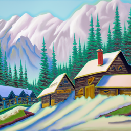
  </figure>
  <figure style="text-align: center; margin: 10px;">
    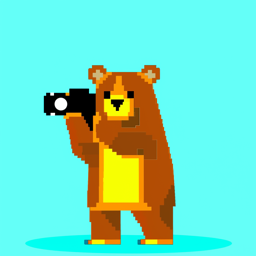
  </figure>

## Programming Project #5 (`proj5`)

*COMPSCI 180 [Intro to Computer Vision and Computational Photography](https://inst.eecs.berkeley.edu/~cs180/fa24/)*

Chuyan Zhou

This webpage uses the Typora **Academic** theme of markdown files.

# Part A

## 0. Setup

### 2 Stages

We first use 3 prompts to let the model generate output images. Here are images and captions displayed below, with different inference steps:

+ 5 steps (i.e. `num_inference_steps=5`):

  + Size: 64px * 64px (Stage 1)

    

      <figure style="text-align: center; margin: 10px;">
        
          <figcaption>an oil painting of   a snowy mountain village</figcaption>
      </figure>
      <figure style="text-align: center; margin: 10px;">
        
        	<figcaption>a man wearing a hat</figcaption>
      </figure>
      <figure style="text-align: center; margin: 10px;">
        
        	<figcaption>a rocket ship</figcaption>
      </figure>
    

  + Size: 256px * 256px (Stage 2)

    

      <figure style="text-align: center; margin: 10px;">
        
          <figcaption>an oil painting of a snowy mountain village</figcaption>
      </figure>
      <figure style="text-align: center; margin: 10px;">
        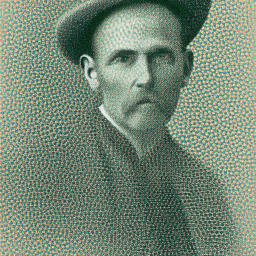
        	<figcaption>a man wearing a hat</figcaption>
      </figure>
      <figure style="text-align: center; margin: 10px;">
        
        	<figcaption>a rocket ship</figcaption>
      </figure>
    

+ 20 steps:

  + Stage 1:

    

      <figure style="text-align: center; margin: 10px;">
        
          <figcaption>an oil painting of a   snowy mountain village</figcaption>
      </figure>
      <figure style="text-align: center; margin: 10px;">
        
        	<figcaption>a man wearing a hat</figcaption>
      </figure>
      <figure style="text-align: center; margin: 10px;">
        
        	<figcaption>a rocket ship</figcaption>
      </figure>
    

  + Stage 2:

    

      <figure style="text-align: center; margin: 10px;">
        
          <figcaption>an oil painting of a   snowy mountain village</figcaption>
      </figure>
      <figure style="text-align: center; margin: 10px;">
        
        	<figcaption>a man wearing a hat</figcaption>
      </figure>
      <figure style="text-align: center; margin: 10px;">
        
        	<figcaption>a rocket ship</figcaption>
      </figure>
    

+ 100 steps:

  + Stage 1:

    

      <figure style="text-align: center; margin: 10px;">
        
          <figcaption>an oil painting of   a snowy mountain village</figcaption>
      </figure>
      <figure style="text-align: center; margin: 10px;">
        
        	<figcaption>a man wearing a hat</figcaption>
      </figure>
      <figure style="text-align: center; margin: 10px;">
        
        	<figcaption>a rocket ship</figcaption>
      </figure>
    

  + Stage 2:

    

      <figure style="text-align: center; margin: 10px;">
        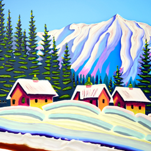
          <figcaption>an oil painting of a   snowy mountain village</figcaption>
      </figure>
      <figure style="text-align: center; margin: 10px;">
        
        	<figcaption>a man wearing a hat</figcaption>
      </figure>
      <figure style="text-align: center; margin: 10px;">
        
        	<figcaption>a rocket ship</figcaption>
      </figure>
    

### Reflection on the generation

We find that for 5 steps, the outputs are not so clear, specifically, the noise added are not removed so completely. We can observe lots of noisy dots in the generated images. The generated feature is also not so clear.

For 20 steps, the noise is removed, and the generated image starts to be decent. The generated images are quite close to the text prompts.

For 100 steps, the generated images are quite clear and the features are well generated, also closer to the text prompts.

### Seed

We use the seed `SEED=42` in this project part.

## 1. Sampling Loops

### 1.1 Implementing the Forward Process

A key part of diffusion is the forward process, which takes a clean image and adds noise to it.

$$
q(x_t | x_0) = N(x_t ; \sqrt{\bar\alpha_t} x_0, (1 - \bar\alpha_t)\mathbf{I})\tag{1}
$$

which is equivalent to an equation giving $x_t$:
$$
x_t = \sqrt{\bar\alpha_t} x_0 + \sqrt{1 - \bar\alpha_t} \epsilon \quad \text{where}~ \epsilon \sim N(0, 1) \tag{2}
$$

That is, given a clean image $x_0$, we get a noisy image $ x_t $ at timestep $t$ by sampling from a Gaussian with mean $ \sqrt{\bar\alpha_t} x_0 $ and variance $ (1 - \bar\alpha_t) $. Note that the forward process is not *_just_* adding noise -- we also scale the image by $\sqrt{\bar\alpha_t}$ and scale the noise by $\sqrt{1-\bar\alpha_t}$. The alpha's cumulated product is actually an equivalent from an iterative noise adding with scheduled $\alpha_t$'s, which is expressed as $\bar{\alpha}_t = \prod_{s=1}^t \alpha_s$. $\bar\alpha_t$ is close to 1 for small $t$, and close to 0 for large $t$. 

We run the forward process on the test image with $ t \in [250, 500, 750] $. Here is the noisy images in different time steps as the results:

  <figure style="text-align: center; margin: 10px;">
    
      <figcaption>Berkeley Campanile</figcaption>
  </figure>
  <figure style="text-align: center; margin: 10px;">
    
    	<figcaption>Noisy Campanile at t=250</figcaption>
  </figure>
  <figure style="text-align: center; margin: 10px;">
    
    	<figcaption>Noisy Campanile at t=500</figcaption>
  </figure>
  <figure style="text-align: center; margin: 10px;">
    
    	<figcaption>Noisy Campanile at t=750</figcaption>
  </figure>

### 1.2 Classical Denoising

From the noisy images above in different time steps, we try using Gaussian blurring filters to denoise them. Respectively, the kernel size for $t\in[250,500,750]$ is `3,5,7`, and the sigma is `1.5,2.5,3.5`. Here we show the trials of denoising using this classical way.

  <figure style="text-align: center; margin: 10px;">
    
    	<figcaption>Noisy Campanile at t=250</figcaption>
  </figure>
  <figure style="text-align: center; margin: 10px;">
    
    	<figcaption>Noisy Campanile at t=500</figcaption>
  </figure>
  <figure style="text-align: center; margin: 10px;">
    
    	<figcaption>Noisy Campanile at t=750</figcaption>
  </figure>

  <figure style="text-align: center; margin: 10px;">
    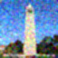
    	<figcaption>Gaussian Blur Denoising at t=250</figcaption>
  </figure>
  <figure style="text-align: center; margin: 10px;">
    
    	<figcaption>Gaussian Blur Denoising at t=500</figcaption>
  </figure>
  <figure style="text-align: center; margin: 10px;">
    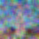
    	<figcaption>Gaussian Blur Denoising at t=750</figcaption>
  </figure>

We can see the Gaussian filters denoise the images so poorly: the original noises are not eliminated, while main features and shapes of the Campanile is blurred.

### 1.3 One-step Denoising

Now, we try to recover $x_0$ using UNet from $x_t$, where $t\in[250,500,750]$. The usage of UNet is not to directly predict $x_0$, but to predict the added noise $\epsilon$. We denote the noise-predicting model (UNet) as $\epsilon_\theta(x_t,t)$, which is also conditioned on the time step $t$ as in the expression.

Here, the expression of $x_0$ can be directly given by the forward equation (2) above, which is the one-step denoising:
$$
x_0 = \frac{1}{\sqrt{\bar{\alpha}_t}} x_t - \frac{\sqrt{1 - \bar{\alpha}_t}}{\sqrt{\bar{\alpha}_t}} \epsilon_\theta(x_t, t)\tag{2.1}
$$
where $\epsilon_\theta$ is the UNet as the noise predictor.

The one-step denoising results (the original image, the noisy image, and the estimate of the original image) are shown below.

  <figure style="text-align: center; margin: 10px;">
    
    	<figcaption>Noisy Campanile at t=250</figcaption>
  </figure>
  <figure style="text-align: center; margin: 10px;">
    
    	<figcaption>Noisy Campanile at t=500</figcaption>
  </figure>
  <figure style="text-align: center; margin: 10px;">
    
    	<figcaption>Noisy Campanile at t=750</figcaption>
  </figure>

  <figure style="text-align: center; margin: 10px;">
    
    	<figcaption>One-Step Denoised Campanile at t=250</figcaption>
  </figure>
  <figure style="text-align: center; margin: 10px;">
    
    	<figcaption>One-Step Denoised Campanile at t=500</figcaption>
  </figure>
  <figure style="text-align: center; margin: 10px;">
    
    	<figcaption>One-Step Denoised Campanile at t=750</figcaption>
  </figure>

We have seen a much better denoising performance in 1.3 i.e. one-step denoising. But when $t$ is larger, it still goes worse: the denoised image is blurred.

### 1.4 Iterative Denoising

The diffusion model by an iterative denoising can solve the problem in 1.3 that for larger $t$, the denoised image starts blurring. Though in the math, the one-step equation is somehow equivalent to the iterative scheme if the models are all (both) perfect, but in real, for a model with limited capability, the latter would be better because it tears the task apart into smaller and easier procedures.

The formula for iterative denoising to estimate the previous step of forwarding (i.e. the next iterated step in denoising) is
$$
x_{t'} = \frac{\sqrt{\bar{\alpha}_{t'} }\beta_t}{1 - \bar{\alpha}_t} x_0 + \frac{\sqrt{\alpha_t }(1 - \bar{\alpha}_{t'})}{1 - \bar{\alpha}_t} x_t + v_\sigma
$$
where

+ $t'$ is the previous forward step i.e. the step we are reducing to in strided timesteps (the model can skip over an amount of steps and still give decent outputs), $t'<t$;
+ $\alpha_t={\bar\alpha_{t'}\over \bar\alpha_t}$;
+ $\beta_t = 1-\alpha_t$;
+ $v_\sigma$ is a variance term also predicted by the model in our case.

Given $x_t$ from the last step, and $x_0$ in this step predicted from the formula (2.1) in 1.3, we can compute $x_{t'}$ from the formula (3). In this project, we set the start of $t$ as 990, and the stride as 30, so that the model skips 30 steps each time and finally arrives at $t=0$ i.e. the original image. The results of denoising are shown below.

  <figure style="text-align: center; margin: 10px;">
    
    	<figcaption>Denoised to t=690</figcaption>
  </figure>
  <figure style="text-align: center; margin: 10px;">
    
    	<figcaption>Denoised to t=540</figcaption>
  </figure>
  <figure style="text-align: center; margin: 10px;">
    
    	<figcaption>Denoised to t=390</figcaption>
  </figure>
  <figure style="text-align: center; margin: 10px;">
    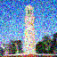
    	<figcaption>Denoised to t=240</figcaption>
  </figure>
  <figure style="text-align: center; margin: 10px;">
    
    	<figcaption>Denoised to t=90</figcaption>
  </figure>

  <figure style="text-align: center; margin: 10px;">
    
    	<figcaption>Original</figcaption>
  </figure>
  <figure style="text-align: center; margin: 10px;">
    
    	<figcaption>Iteratively Denoised</figcaption>
  </figure>
  <figure style="text-align: center; margin: 10px;">
    
    	<figcaption>One-step denoised</figcaption>
  </figure>
  <figure style="text-align: center; margin: 10px;">
    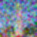
    	<figcaption>Gaussian Blurred</figcaption>
  </figure>

### 1.5 Diffusion Model Sampling

In this part, we use another important use of diffusion models other than denoising: sampling from the real-image manifold. We feed the iterative denoising function with randomly (drawn from Gaussian) generated noises, using the prompt `"a high quality photo"` as a "null" prompt as a way to let the model simply do unconditional generation.

Here are 5 images from sampling from the "null" prompt:

  <figure style="text-align: center; margin: 10px;">
    
    	<figcaption>Sample 1</figcaption>
  </figure>
  <figure style="text-align: center; margin: 10px;">
    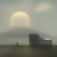
    	<figcaption>Sample 2</figcaption>
  </figure>
  <figure style="text-align: center; margin: 10px;">
    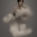
    	<figcaption>Sample 3</figcaption>
  </figure>
  <figure style="text-align: center; margin: 10px;">
    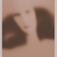
    	<figcaption>Sample 4</figcaption>
  </figure>
  <figure style="text-align: center; margin: 10px;">
    
    	<figcaption>Sample 5</figcaption>
  </figure>

These images are reasonable, but not too clear nor spectacular. We can enhance this by CFG in the next section.

### 1.6 Classifier-free Guidance

For a noise or generally, input image, we have the generation conditioned on some prompts. For the same input without conditioning, the model can estimate an unconditional noise denoted as $\epsilon_u$, and another estimated noise conditioned on the prompt as usual denoted as $\epsilon_c$. Note that we use a truly empty prompt for generating $\epsilon_u$, not the "null" prompt mentioned above. Actually, the "null" prompt can be the conditioning in this case, for an unconditional generation in the outer context.

The estimate of the noise, from above, is expressed as
$$
\epsilon=\epsilon_u+\gamma(\epsilon_c-\epsilon_u)=\gamma\epsilon_c+(1-\gamma)\epsilon_u
\tag 4
$$
where $\gamma$ is the scale factor, which we set as $\gamma=7$ in this project.

Basically, this can be seen as a guidance, i.e. a push ($\epsilon_c-\epsilon_u$) from the unconditional point in the manifold to the conditional point, that pushes the image to have more "conditional-ness". For example, for a dog as the conditioning, pushing this can make the image resemble a dog more, i.e. have more dog-ness.

If we set $\gamma=1$, the push will be equivalent as that in the above section, which is shown not so effective. If $\gamma>1$, the push will be enhanced, which is what we are doing in CFG.

Here are 5 images from sampling from the "null" prompt, with CFG at scale $\gamma=7$:

  <figure style="text-align: center; margin: 10px;">
    
    	<figcaption>Sample 1</figcaption>
  </figure>
  <figure style="text-align: center; margin: 10px;">
    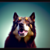
    	<figcaption>Sample 2</figcaption>
  </figure>
  <figure style="text-align: center; margin: 10px;">
    
    	<figcaption>Sample 3</figcaption>
  </figure>
  <figure style="text-align: center; margin: 10px;">
    
    	<figcaption>Sample 4</figcaption>
  </figure>
  <figure style="text-align: center; margin: 10px;">
    
    	<figcaption>Sample 5</figcaption>
  </figure>

The result images are much better.

### 1.7 Image-to-Image Translation

In this part, we follow [SDEdit](https://sde-image-editing.github.io/) algorithm to transform one image (our inputs) to another with some conditioning. This can be done with inputting the iterative denoising pipeline with our input images, and set a `t` (or an equivalent index of the strided time steps i.e. `i_start` a.k.a. noise level), which is the forward step. `t` is seen as a claimed level of the noises added to the input, i.e. how much "noise" should the model "reduce" into "the original image". The smaller the noise level is, the more `t` is, and the more the image is denoised (edited).

We use given noise levels [1, 3, 5,7, 10, 20] and the "null" prompt i.e. `"a high quality photo"` as the conditioning. Results are shown below:

**Result 1: Berkeley Campanile**

  <figure style="text-align: center; margin: 10px;">
    
    	<figcaption>Berkeley Campanile at Noise Level 1</figcaption>
  </figure>
  <figure style="text-align: center; margin: 10px;">
    
    	<figcaption>Berkeley Campanile at Noise Level 3</figcaption>
  </figure>
  <figure style="text-align: center; margin: 10px;">
    
    	<figcaption>Berkeley Campanile at Noise Level 5</figcaption>
  </figure>
  <figure style="text-align: center; margin: 10px;">
    
    	<figcaption>Berkeley Campanile at Noise Level 7</figcaption>
  

  </figure>
  <figure style="text-align: center; margin: 10px;">
    
    	<figcaption>Berkeley Campanile at Noise Level 10</figcaption>
  </figure>
  <figure style="text-align: center; margin: 10px;">
    
    	<figcaption>Berkeley Campanile at Noise Level 20</figcaption>
  </figure>
  <!-- original -->
  <figure style="text-align: center; margin: 10px;">
    
    	<figcaption>Berkeley Campanile</figcaption>
  </figure>

**Result 2: Self-selected image 1**

  <figure style="text-align: center; margin: 10px;">
  
    <figcaption>kusa.png at Noise Level 1</figcaption>
  </figure>
  <figure style="text-align: center; margin: 10px;">
  
    <figcaption>kusa.png at Noise Level 3</figcaption>
  </figure>
  <figure style="text-align: center; margin: 10px;">
  
    <figcaption>kusa.png at Noise Level 5</figcaption>
  </figure>
  <figure style="text-align: center; margin: 10px;">
  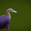
    <figcaption>kusa.png at Noise Level 7</figcaption>
  </figure>
  

  <figure style="text-align: center; margin: 10px;">
  
    <figcaption>kusa.png at Noise Level 10</figcaption>
  </figure>
  <figure style="text-align: center; margin: 10px;">
  
    <figcaption>kusa.png at Noise Level 20</figcaption>
  </figure>
  <!-- original, same folder / kusa_resized.png -->
  <figure style="text-align: center; margin: 10px;">
  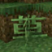
    <figcaption>kusa.png</figcaption>
  </figure>

**Result 3: Self-selected image 2**

  <figure style="text-align: center; margin: 10px;">
  
    <figcaption>pien.png at Noise Level 1</figcaption>
  </figure>
  <figure style="text-align: center; margin: 10px;">
  
    <figcaption>pien.png at Noise Level 3</figcaption>
  </figure>
  <figure style="text-align: center; margin: 10px;">
  
    <figcaption>pien.png at Noise Level 5</figcaption>
  </figure>
  <figure style="text-align: center; margin: 10px;">
  
    <figcaption>pien.png at Noise Level 7</figcaption>
  </figure>
  

  <figure style="text-align: center; margin: 10px;">
  
    <figcaption>pien.png at Noise Level 10</figcaption>
  </figure>
  <figure style="text-align: center; margin: 10px;">
  
    <figcaption>pien.png at Noise Level 20</figcaption>
  </figure>
  <figure style="text-align: center; margin: 10px;">
  
    <figcaption>pien.png</figcaption>
  </figure>

#### 1.7.1 Editing Hand-Drawn and Web Images

Same as above, we pick some images from the web & hand-drawn and feed them into the translation.

**Result 1: Web image**

<figure style="text-align: center; margin: 10px;">
  
    <figcaption>Web Image</figcaption>
</figure>

  <figure style="text-align: center; margin: 10px;">
  
    <figcaption>Web Image at Noise Level 1</figcaption>
  </figure>
  <figure style="text-align: center; margin: 10px;">
  
    <figcaption>Web Image at Noise Level 3</figcaption>
  </figure>
  <figure style="text-align: center; margin: 10px;">
  
    <figcaption>Web Image at Noise Level 5</figcaption>
  </figure>
  <figure style="text-align: center; margin: 10px;">
  
    <figcaption>Web Image at Noise Level 7</figcaption>
  </figure>
  

  <figure style="text-align: center; margin: 10px;">
  
    <figcaption>Web Image at Noise Level 10</figcaption>
  </figure>
  <figure style="text-align: center; margin: 10px;">
  
    <figcaption>Web Image at Noise Level 20</figcaption>
  </figure>
  <figure style="text-align: center; margin: 10px;">
  
    <figcaption>Web Image resized</figcaption>
  </figure>

**Result 2: Hand-drawn image 1**

<figure style="text-align: center; margin: 10px;">
  
    <figcaption>Hand-drawn Image 1: A Cruise</figcaption>
</figure>

  <figure style="text-align: center; margin: 10px;">
  
    <figcaption>Hand-drawn Image 1 at Noise Level 1</figcaption>
  </figure>
  <figure style="text-align: center; margin: 10px;">
  
    <figcaption>Hand-drawn Image 1 at Noise Level 3</figcaption>
  </figure>
  <figure style="text-align: center; margin: 10px;">
  
    <figcaption>Hand-drawn Image 1 at Noise Level 5</figcaption>
  </figure>
  <figure style="text-align: center; margin: 10px;">
  
    <figcaption>Hand-drawn Image 1 at Noise Level 7</figcaption>
  </figure>
  

  <figure style="text-align: center; margin: 10px;">
  
    <figcaption>Hand-drawn Image 1 at Noise Level 10</figcaption>
  </figure>
  <figure style="text-align: center; margin: 10px;">
  
    <figcaption>Hand-drawn Image 1 at Noise Level 20</figcaption>
  </figure>
  <figure style="text-align: center; margin: 10px;">
  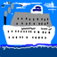
    <figcaption>Hand-drawn Image 1 resized</figcaption>
  </figure>

**Result 3: Hand-drawn image 2**

<figure style="text-align: center; margin: 10px;">
  
    <figcaption>Hand-drawn Image 2: A Lemon</figcaption>
</figure>

  <figure style="text-align: center; margin: 10px;">
  
    <figcaption>Hand-drawn Image 2 at Noise Level 1</figcaption>
  </figure>
  <figure style="text-align: center; margin: 10px;">
  
    <figcaption>Hand-drawn Image 2 at Noise Level 3</figcaption>
  </figure>
  <figure style="text-align: center; margin: 10px;">
  
    <figcaption>Hand-drawn Image 2 at Noise Level 5</figcaption>
  </figure>
  <figure style="text-align: center; margin: 10px;">
  
    <figcaption>Hand-drawn Image 2 at Noise Level 7</figcaption>
  </figure>
  

  <figure style="text-align: center; margin: 10px;">
  
    <figcaption>Hand-drawn Image 2 at Noise Level 10</figcaption>
  </figure>
  <figure style="text-align: center; margin: 10px;">
  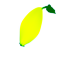
    <figcaption>Hand-drawn Image 2 at Noise Level 20</figcaption>
  </figure>
  <figure style="text-align: center; margin: 10px;">
  
    <figcaption>Hand-drawn Image 2 resized</figcaption>
  </figure>

#### 1.7.2 Inpainting
Now, we implement a hole-filling (inpainting) algorithm. We use the same iterative denoising pipeline, but with a mask $\bold m$ on the input image. Mask values i.e. values in $\bold m$ for pixels to be inpainted are set to 1, and those for the rest (the known pixels) are set to 0. The mask is fed into the model as an additional input. Initially, we also produce a Gaussian noise as above, and we also hold the original image as $x_{orig}$. Then, every time we iteratively denoise from $t$ to $t'$, we follow this formula according to [this](https://arxiv.org/abs/2201.09865) paper:
$$
x_{t'} = \bold m \odot x_{t'} + (1-\bold m) \odot \text{forward}(x_{orig},t')\tag 5
$$
where $\odot$ is the element-wise multiplication. This formula is to fill the holes in the image with the inpainted pixels from the iterative denoising. The results are shown below.

**Result 1: Berkeley Campanile**

  <figure style="text-align: center; margin: 10px;">
    
    	<figcaption>Original</figcaption>
  </figure>
  <figure style="text-align: center; margin: 10px;">
    
    	<figcaption>Mask</figcaption>
  </figure>
  <figure style="text-align: center; margin: 10px;">
    
    	<figcaption>Hole</figcaption>
  </figure>
  <figure style="text-align: center; margin: 10px;">
    
    	<figcaption>Inpainted</figcaption>
  </figure>

**Result 2: Self-selected image 1**

  <figure style="text-align: center; margin: 10px;">
    
    	<figcaption>Original</figcaption>
  </figure>
  <figure style="text-align: center; margin: 10px;">
    
    	<figcaption>Mask</figcaption>
  </figure>
  <figure style="text-align: center; margin: 10px;">
    
    	<figcaption>Hole</figcaption>
  </figure>
  <figure style="text-align: center; margin: 10px;">
    
    	<figcaption>Inpainted</figcaption>
  </figure>

**Result 3: Self-selected image 2**

  <figure style="text-align: center; margin: 10px;">
    
    	<figcaption>Original</figcaption>
  </figure>
  <figure style="text-align: center; margin: 10px;">
    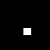
    	<figcaption>Mask</figcaption>
  </figure>
  <figure style="text-align: center; margin: 10px;">
    
    	<figcaption>Hole</figcaption>
  </figure>
  <figure style="text-align: center; margin: 10px;">
    
    	<figcaption>Inpainted</figcaption>
  </figure>

#### 1.7.3 Text-Conditional Image-to-image Translation
In this part, we do the same as in 1.7 and 1.7.1. But we use a text prompt as the conditioning. The text prompt is `"a rocket ship"`. The results are shown below.

**Result 1: Berkeley Campanile**

  <figure style="text-align: center; margin: 10px;">
    
    	<figcaption>Berkeley Campanile at Noise Level 1</figcaption>
  </figure>
  <figure style="text-align: center; margin: 10px;">
    
    	<figcaption>Berkeley Campanile at Noise Level 3</figcaption>
  </figure>
  <figure style="text-align: center; margin: 10px;">
    
    	<figcaption>Berkeley Campanile at Noise Level 5</figcaption>
  </figure>
  <figure style="text-align: center; margin: 10px;">
    
    	<figcaption>Berkeley Campanile at Noise Level 7</figcaption>
  </figure>
  

  <figure style="text-align: center; margin: 10px;">
    
    	<figcaption>Berkeley Campanile at Noise Level 10</figcaption>
  </figure>
  <figure style="text-align: center; margin: 10px;">
    
    	<figcaption>Berkeley Campanile at Noise Level 20</figcaption>
  </figure>
  <!-- original -->
  <figure style="text-align: center; margin: 10px;">
    
    	<figcaption>Berkeley Campanile</figcaption>
  </figure>

**Result 2: Self-selected image 1**

  <figure style="text-align: center; margin: 10px;">
    
    	<figcaption>kusa.png at Noise Level 1</figcaption>
  </figure>
  <figure style="text-align: center; margin: 10px;">
    
    	<figcaption>kusa.png at Noise Level 3</figcaption>
  </figure>
  <figure style="text-align: center; margin: 10px;">
    
    	<figcaption>kusa.png at Noise Level 5</figcaption>
  </figure>
  <figure style="text-align: center; margin: 10px;">
    
    	<figcaption>kusa.png at Noise Level 7</figcaption>
  </figure>
  

  <figure style="text-align: center; margin: 10px;">
    
    	<figcaption>kusa.png at Noise Level 10</figcaption>
  </figure>
  <figure style="text-align: center; margin: 10px;">
    
    	<figcaption>kusa.png at Noise Level 20</figcaption>
  </figure>
  <!-- original, same folder / kusa_resized.png -->
  <figure style="text-align: center; margin: 10px;">
    
    	<figcaption>kusa.png</figcaption>
  </figure>

**Result 3: Self-selected image 2**

  <figure style="text-align: center; margin: 10px;">
    
    	<figcaption>pien.png at Noise Level 1</figcaption>
  </figure>
  <figure style="text-align: center; margin: 10px;">
    
    	<figcaption>pien.png at Noise Level 3</figcaption>
  </figure>
  <figure style="text-align: center; margin: 10px;">
    
    	<figcaption>pien.png at Noise Level 5</figcaption>
  </figure>
  <figure style="text-align: center; margin: 10px;">
    
    	<figcaption>pien.png at Noise Level 7</figcaption>
  </figure>
  

  <figure style="text-align: center; margin: 10px;">
    
    	<figcaption>pien.png at Noise Level 10</figcaption>
  </figure>
  <figure style="text-align: center; margin: 10px;">
    
    	<figcaption>pien.png at Noise Level 20</figcaption>
  </figure>
  <figure style="text-align: center; margin: 10px;">
    
    	<figcaption>pien.png</figcaption>
  </figure>

### 1.8 Visual Anagrams

In this part, we use the iterative denoising pipeline to [generate visual anagrams (according to this research)](https://dangeng.github.io/visual_anagrams/),
which is basically a image that shows a feature when watched ordinarily without being transformed, and another feature when watched upside down.

We can implement this by modifying the noise estimate. One estimate from the noised image now i.e. $x_t$ is based on $p_1$ which is the first prompt, and another estimate from the flipped image $\text{flip}(x_t)$ is based on $p_2$ i.e. the second prompt. Then the estimate for the flipped image is flipped again, aligned with the direction of the ordinary view. Finally, these two estimates are averaged, and the desired estimate is outputted. The process can be expressed as:
$$
\epsilon_1 = \text{UNet}(x_t, t, p_1) \\
\epsilon_2 = \text{flip}(\text{UNet}(\text{flip}(x_t), t, p_2)) \\
\epsilon = \frac{\epsilon_1 + \epsilon_2}{2}\tag 6.
$$
The results are shown below.

**Result 1**

  <figure style="text-align: center; margin: 10px;">
    
    	<figcaption>Ordinary: an oil painting of people around a campfire</figcaption>
  </figure>
  <figure style="text-align: center; margin: 10px;">
    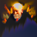
    	<figcaption>Flipped: an oil painting of an old man</figcaption>
  </figure>

**Result 2**

  <figure style="text-align: center; margin: 10px;">
    
    	<figcaption>Ordinary: a lithograph of waterfalls</figcaption>
  </figure>
  <figure style="text-align: center; margin: 10px;">
    
    	<figcaption>Flipped: a photo of a dog</figcaption>
  </figure>

**Result 3**

  <figure style="text-align: center; margin: 10px;">
    
    	<figcaption>Ordinary: an oil painting of a snowy mountain village</figcaption>
  </figure>
  <figure style="text-align: center; margin: 10px;">
    
    	<figcaption>Flipped: a photo of a hipster barista</figcaption>
  </figure>

### 1.9 Hybrid Images

In this section, we perform the hybrid image generation, which is to generate an image that shows one feature in low frequency (far away / blurredly) and another feature in high frequency (closely / clearly), based on [this paper (Factorized Diffusion)](https://arxiv.org/abs/2404.11615). We estimate the noise by these formulas:
$$
\epsilon_1 = \text{UNet}(x_t, t, p_1) \\
\epsilon_2 = \text{UNet}(x_t, t, p_2) \\
\epsilon = f_\text{lowpass}(\epsilon_1) + f_\text{highpass}(\epsilon_2)
\tag 7
$$
where $f_\text{lowpass}$ and $f_\text{highpass}$ are the low-pass and high-pass filters, respectively. 

We use a kernel size of 33 and sigma of 2 as is recommended in the project spec for the LP filter as a Gaussian filter, and the HP filter is to find the difference between the original image and the LP-filtered image, i.e. the difference between identity and the LP filter. The results are shown below.

I used the text encoder instead of predetermined `.pth` embeddings to get the embeddings for my DIY prompts as in Result 2 and 3.

**Result 1**
Low pass: a lithograph of a skull
High pass: a lithograph of waterfalls

  <figure style="text-align: center; margin: 10px;">
    
    	<figcaption>Hybrid Image of a skull and waterfalls</figcaption>
  </figure>

**Result 2**
Low pass: a salmon sushi nigiri
High pass: a sitting orange cat with a white belly

  <figure style="text-align: center; margin: 10px;">
    
    	<figcaption>Hybrid Image of a salmon sushi nigiri and a cat</figcaption>
  </figure>

**Result 3**
Low pass: a photo of the Ayers rock
High pass: a photo of a dog lying on stomach

  <figure style="text-align: center; margin: 10px;">
    
    	<figcaption>Hybrid Image of the Ayers rock and a dog</figcaption>
  </figure>

## 2. Bells & Whistles

+ I used the text encoder instead of predetermined `.pth` embeddings to get the embeddings for my DIY prompts as above.

### 2.1 A logo for the CS180 course
I designed a logo for this course, CS180, using the model stage 1 above, and also upsampled it to a higher resolution using stage 2 of the model. 

The logo is a pixelated bear holding a camera, ready to taking a photo.

The logo is shown below:

  <figure style="text-align: center; margin: 10px;">
    
    	<figcaption>CS180 Logo</figcaption>
  </figure>

# Part B

